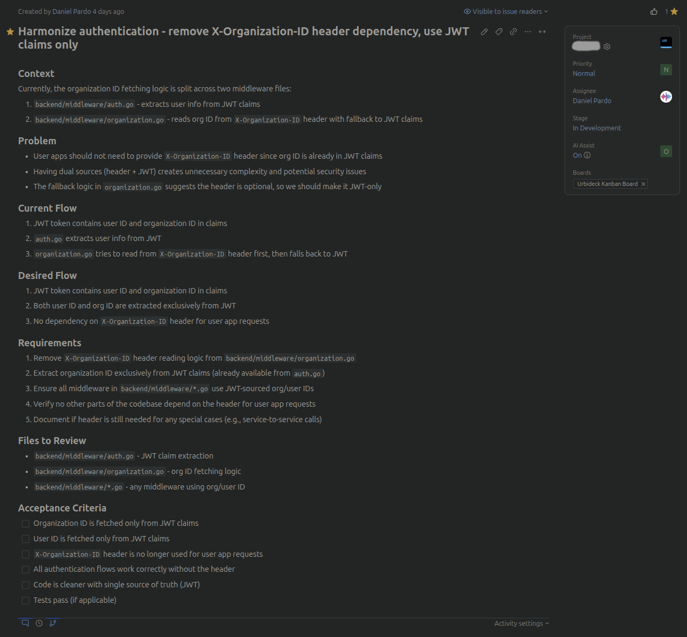
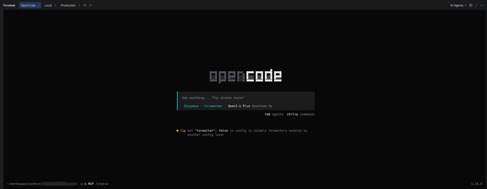

<!-- Header Banner -->
<div align="center">

# 👋 Hi, Daniel here!

### **Platform Engineer & DevEx Specialist**


**Specialized in Software Engineering at Enterprise Scale**


📍 Zaragoza, Spain &nbsp;|&nbsp; 🏢 IriusRisk • Adidas • New Relic &nbsp;|&nbsp;
📧 [LinkedIn](https://www.linkedin.com/in/danielpardoligorred/)

</div>

<br>

<div align="center">

━━━━━━━━━━━━━━━━━━━━━━━━━━━━━━━━━━━━━━━━━━━━━━━━━━━━

</div>

## 👤 About Me

As a kid, I loved building with Meccano. But the first time I saw a mouse pointer move across a screen, everything
changed. That simple magic hooked me on programming, and I haven't stopped building since.

I started writing code at twelve. By my early twenties, I turned that passion into a career, freelancing to build custom
e-commerce sites and digital tools for clients. Over two decades later, after working with international companies
like **IriusRisk**, **Adidas**, and **New Relic**, I've evolved from designing and writing distributed systems to
designing the platforms that power them.

Today I build ecosystems that reduce cognitive load and automate the boring
stuff, so engineering teams can focus on delivering value instead of fighting with technological friction.

If I had to choose one testimonial from the thousands of interactions throughout my career, I would highlight this one
by one of my line managers at Adidas.
> The one engineer to go for getting things done.
>
> -- [Jose Maria Puyal](https://www.linkedin.com/in/josepuyal/)
>
> Context: Creator's Club MVP delivery in the EEUU during the summer of 2018.

### 🔥 What I Do in My Free Time

I pour my energy into three main passions.

- **[Financial Literacy](https://www.financialbreaker.com)** - understanding how the world works.
- **Software Engineering** - building things to solve complex problems.
- **[Electronic Music Production](https://open.spotify.com/artist/42xGjvlq05ZQ90f398AhGh?si=zeroAFZKST-uKi-R7PqMTQ)** -
  fueling my soul while sharing it with others.

These three areas are where I invest my energy and the topics I most enjoy exploring in conversation.

## 🥋 The Mandalorian Creed: Learning by Doing was Always the Way

Despite the catchy section title, what follows isn't self-promotion, it's the genuine approach that defines my way of
being.

It has never been about writing code or studying theory, nor even finding a job, making profits in the market, or
understanding how the frequencies of sound shape an 808 distorted kick. It's always been about mastering the craft
through deep understanding of what once caught my attention.

Having a purpose that I believe in is the fuel to keep me going.

> I hear and I forget. I see and I remember. I do and I understand.
>
> — Confucius

## 🤖 Engineering Craft in the Age of AI

My approach to software engineering is evolving rapidly alongside AI capabilities. While AI assistants are transforming
how we code, I believe **fundamentals must remain intact** to maintain control over what we build. Here's how I navigate
this new era.

### 📋 Preserving My Core Engineering Skills

I strongly believe that while code is becoming a commodity with AI assistants, **engineering fundamentals should remain
intact** to keep control of what we're building with AI.

At the end of 2025, I started a personal repository  
**[CodingChallenge-Python](https://github.com/danipl/CodingChallenge-Python)**, where I tackle algorithm challenges
regularly. I use a **custom Gemini Gem** deliberately crafted to support this journey, it designs the challenges and
builds the Python classes with pytest scaffolding, so I can focus on enjoying the problem-solving itself.

This practice keeps my problem-solving muscles sharp while leveraging AI for the boilerplate.

> **Find the prompt:** [HERE](./media/Whiteboard%20Algo%20Coach%20For%20Python.md)

### 🔄 My Delivery Workflow

Working in this new AI era requires a disciplined three-phase approach. The trap many fall into is accepting "working
output" without questioning the structural cost.

#### 📋 Phase 1: Specification & Definition

**From task description and acceptance criteria to precise specification.**

AI coding agents deliver functionality, but they often lack **structural vision**. Delegating tasks without revision
gives a false sense of success, the feature works, but it comes with a hidden cost in design debt that will cause pain
in the future.

A good specification **stretches the funnel** of the AI coding agent's freedom during delivery, ensuring it implements
what we're projecting in mind. This is critical especially during and after the early stages of projects, where all the
bootstrapping is being done and the foundational architecture is being established.

**My approach:**

- Translate vague requirements into precise, actionable specifications
- Define architectural constraints and patterns upfront
- Set clear boundaries for AI agent autonomy
- Review and refine before any implementation begins



#### 🔨 Phase 2: Implementation (Human-in-the-Loop)

**Coding / AI-Assisted Coding / Live Coding / Whatever You Want to Call It**

This is the implementation phase, where **TDD has become even more important than before**, and where human revision is
mandatory.

As engineers, we must **remain in the loop**. An AI planning system can do great work on complex specifications, but it
can also loop endlessly without success on something that feels easy to humans. Getting in the loop, using the IDE for a
while, and helping establish foundations is mandatory.

**Being pragmatic:** For easy, single-responsibility microservices, I'm often faster than AI agents when prototyping
Spring applications with some services—just using inline code completion and quick AI assistance. No need to waste 300K
tokens (and drying lakes... just kidding :D).

**My approach:**

- Write tests first (TDD is non-negotiable, by prompting it is OK)
- Intervene when AI agents loop on "simple" problems
- Use inline AI assistance for boilerplate and scaffolding
- Step in personally for foundational code and critical paths when it's necessary
- Review every line and the CONTEXT before committing

#### 🛡️ Phase 3: Quality Assurance

**The safety net that makes AI-assisted development sustainable.**

When you have a good implementation flow following TDD, unit testing shines. AI agents remain unpredictable, and
mastering this third stage is crucial to avoid breaking existing functionality.

**My approach:**

- Comprehensive unit test coverage (non-negotiable)
- Integration tests for critical paths
- Automated CI/CD validation
- Manual review of AI-generated code before merge

### 🛠️ My Tooling Philosophy

I manage personal subscriptions to Google and Alibaba models. As of today, **Anthropic models are the best** especially
for backend implementations, but honestly, I believe **Google is going to win the AI battle**.

**Lock-in and patience**, rather than moving from one provider to another, staying committed is often the winning
strategy, especially when dealing with budgets coming from your pocket. At the enterprise level? I use whatever it
takes.

**Current setup:**

- **Google AI** — Primary provider (long-term bet)
- **Opencode Go** — Best cost/performance ratio.
- **Anthropic (through Google AI)** — Reserved for exceptional cases where their models bring something uniquely better

### 💻 Local Development Setup

Sitting back and watching what happens between Google and the open-source ecosystem, right now I use a **multi-tool
environment** that I hope to consolidate into one place eventually.

| Tool                                         | Purpose            | Why                                                                                                                      |
|----------------------------------------------|--------------------|--------------------------------------------------------------------------------------------------------------------------|
| **IntelliJ Ultimate** (with AI subscription) | Primary IDE        | Top-tier inline AI Assistant + all-in-one environment (terminal, database, SSH, Spring, Kubernetes, Docker integrations) |
| **OpenCode + OhMyOpenCode**                  | Agentic AI         | Run from IntelliJ terminal for unified experience. I use Opencode Go models — excellent performance.                     |
| **Antigravity**                              | Multi-model access | For using Google and Anthropic models in exceptional cases where Anthropic may bring something better.                   |



#### Token Efficiency

Token efficiency is crucial for AI coding, as it directly impacts the cost and performance of AI-assisted development.
By optimizing token usage, developers can maximize the effectiveness of their AI tools while minimizing expenses.

This is particularly important for large-scale projects or when working with limited budgets.

| Tool                                                | Purpose                   | Why                                                                                                                          |
|-----------------------------------------------------|---------------------------|------------------------------------------------------------------------------------------------------------------------------|
| [Rtk-ai](https://github.com/rtk-ai/rtk)             | Input tokens cleaning     | Optimizes input tokens by removing unnecessary content before sending to AI models, reducing costs and improving performance |
| [Caveman](https://github.com/JuliusBrussee/caveman) | Output tokens performance | Instructs the LLM to use compressed communication patterns, reducing token usage while preserving information quality        |

### 🤝 AI-Assisted Team Collaboration

Many coding tasks are trivial or close to trivial. For my personal projects, I have an **AI coding assistant** that
bootstraps implementations from the very beginning—coding the solution and opening a PR automatically.


Communication happens through a **Telegram channel**, where **OpenClaw** (my AI assistant system) uses a Telegram bot
that all collaborators in the group can use to interact with the AI.


**The bot was taught to:**

- **Manage YouTrack boards** through MCP integration — creates tickets with specifications by summarizing conversations
  in the Telegram channel. Tickets can be refined by interacting with the same bot.
- **Access GitHub Org repositories** with restricted collaboration rights.

This setup helps me and my teammates get right into the context of implementations without wasting time finding the
proper places for changes while switching context. Many times it's only about reviewing the implementation; other times
I need to get in the loop; and a few times, start from scratch.

**Overall, the capacity increase is huge.**

### 📝 Summary: My Philosophy

> **AI is a force multiplier, not a replacement for engineering judgment (so far).**

- **Fundamentals first** — TDD, clean architecture, and problem-solving skills remain non-negotiable
- **Human-in-the-loop** — AI agents amplify capability, but human oversight ensures quality
- **Pragmatic tooling** — Use the right model for the right job, balance cost vs. performance
- **Specification-driven** — Clear requirements prevent AI from optimizing for the wrong outcomes
- **Team amplification** — AI assistants should increase team capacity, not create dependency

---

## 🏗️ What I'm Building

### 🏭 SandboxForge | Ephemeral Sandboxes Management Tool

| Key                    | Value                        |
|------------------------|------------------------------|
| **Project**            | SandboxForge                 |
| **Role**               | Founder - Platform Architect |
| **Duration**           | March 2026 – Present         |
| **Location**           | Remote / Zaragoza, Spain     |
| **Status**             | 🟢 Active — Work in Progress |
| **Personal Relevance** | ⭐⭐⭐⭐⭐                        |


### 📍 The Origin

The vision started at **IriusRisk** in mid-2025. The company was transitioning from a monolith to domain-driven
microservices, and the existing sandbox system couldn't scale. I began researching what a next-generation solution would
need, until the ThreatModeler acquisition cleared the backlog and the roadmap was shelved.

That research didn't disappear. It crystallized into a personal conviction: **ephemeral sandbox management is going to
become a strategic necessity**, not a nice-to-have. In March 2026, I started building this lab outside my enterprise
role to shape my expertise in the field and prepare for the professional role I'm targeting next.

### ⚠️ The Problem This Solves

The tech industry is shifting from simple applications deployable via local `docker engine` to **complex enterprise
systems**
requiring orchestration, multi-provider authentication, and intricate service interdependencies. So running these
locally
is becoming impractical.

Three converging forces make this critical:

* **Microservices proliferation** — dozens of services, multiple versions, all needing to work as one. Tracking
  configurations and version compatibility becomes a full-time job.
* **Cross-functional collaboration** — product owners, support teams, and stakeholders need accessible environments
  during development, not just at release. At IriusRisk, ephemeral sandboxes drastically improved Deployment Frequency
  and Lead Time for Changes by getting non-engineers in the loop early.
* **Agentic AI needs safe spaces** — autonomous AI agents, local coding assistants, and multi-agent systems need their
  own isolated environments alongside human developers. **MCP integration** enables agentic AI to discover, access, and
  interact with sandboxes programmatically, a requirement that is going to shape the near future.

### 🧩 The Complexity Challenge

Ephemeral sandboxes are, by definition, **born and die on demand**. Everything spins up from scratch and tears down
cleanly. This makes them one of the most complex challenges in the engineering ecosystem:

* **Orchestration at scale** — allocating and deallocating all services, configurations, and dependencies dynamically
* **FinOps by design** — sandboxes must scale to zero when idle. It is not an optimization, it is a mandatory feature to
  control costs. The trade-off? Even more complexity in state management and warm-up strategies
* **Resilience patterns** — rate limiting, circuit breakers, and graceful degradation across transient environments
* **Service mesh & load balancing** — routing traffic to environments that may not exist yet and will disappear soon
* **Sandbox security** - isolated network policies, RBAC enforcement to isolate and ensure every ephemeral environment
  operates within strict boundaries without compromising the sandbox integrity
* **Event-driven architecture** — Kafka-based event streaming for sandbox lifecycle management, status tracking, and
  inter-service communication

### 🏗️ What I'm Building

* **Core Platform (Java 21 + Spring):** Business logic layer tracking sandbox lifecycle, status, resource allocation,
  and user access control.
* **Event Streaming Backbone (Apache Kafka + RisingWave):** Kappa architecture for real-time sandbox state management,
  lifecycle events, and streaming analytics.
* **Kubernetes Orchestration:** Vertical and horizontal auto-scalers, dynamic namespace provisioning, resource quotas,
  and network policies per sandbox.
* **GitOps Pipeline (Helm + ArgoCD):** Declarative sandbox templating — each sandbox is a Helm chart deployed through
  ArgoCD, ensuring reproducibility and version control.
* **Service Mesh Layer:** Traffic management, mTLS, and observability across ephemeral environments.
* **MCP Integration:** Model Context Protocol servers enabling agentic AI systems to discover, access, and interact with
  sandboxes programmatically.
* **Management UI (React Native):** Cross-platform interface for creating, monitoring, and managing sandboxes.

### 💡 Why This Matters

This is **by far the most complex topic I've managed** in my career. It combines everything I've learned, platform
engineering, distributed systems, streaming architecture, and AI-first collaboration from current workflows, into a
single, deeply challenging problem space.

But complexity isn't the point. The point is that **ephemeral sandbox management is going to become a strategic pivot
point for high-performance, scalable enterprises in the AI era**.

Companies that solve this will ship faster, collaborate better, and integrate AI agents seamlessly. Companies that don't
will drown in environment management overhead.

This lab is where I'm building the expertise to lead that transformation. Once it's ready and shareable, I'll open it to
the community.

---

### 🚀 AI Software Factory | Venture Incubator

| Key                    | Value                    |
|------------------------|--------------------------|
| **Initiative**         | AI Software Factory      |
| **Role**               | Founder                  |
| **Duration**           | Early 2026 – Present     |
| **Location**           | Remote / Zaragoza, Spain |
| **Status**             | 🟢 Active Development    |
| **Personal Relevance** | ⭐⭐⭐ (Early stage)        |

**The Concept**

A private business-oriented venture. The AI Software Factory operates as an **umbrella organization** where a
cross-functional team, **AI specialists, engineers, and commercials**, works with a lean methodology mindset: bootstrap
ideas quickly with AI, validate them in the market as fast as possible, and pivot based on real feedback.

**How It Works**

* **Lean Methodology:** Rapid ideation → fast bootstrapping → early market validation → iterate or pivot. Speed to
  market is the core metric.
* **Cross-Functional Team:** Three complementary profiles (AI, engineering, commercial) working in tight coordination —
  no silos, no handoff delays.
* **Agentic AI as Team Multiplier:** AI is not just a coding assistant. It boosts the entire team's capacity across
  administrative tasks, coordination, brainstorming, and decision-making. The AI collaboration platform is already
  operational and actively used by the team.
* **Learning by Doing:** Every project under this umbrella is a learning vehicle, testing new architectures, new
  technologies, new market approaches with real stakes, not theoretical exercises.

*(The workflow images in the "Local Development Setup" section above come from this initiative.)*

### 💡 Why This Matters

This is the first time I'm building a business from the ground up with AI as a first-class team member, not just a tool.
It's where two decades of platform engineering, distributed systems, and enterprise transformation experience converge
into a single mission.

---

#### 🚩 Flagship Project: Smart Cities Platform

| Key                    | Value                    |
|------------------------|--------------------------|
| **Project**            | Smart Cities Platform    |
| **Role**               | Platform Architect       |
| **Duration**           | Early 2026 – Present     |
| **Location**           | Remote / Zaragoza, Spain |
| **Status**             | 🟢 Active Development    |
| **Personal Relevance** | ⭐⭐ (Early stage)         |


### 📍 The Context

Born from a personal necessity, the flagship project blends people administration, documentation management, and smart
cities concepts into a unified platform. It's the first product under the AI Software Factory umbrella, the proving
ground for the lean methodology and AI-first team approach.

**The Architecture: Client-Server Edge with IoT Swarm**

The platform follows an **Client-Server Edge Architecture**, a central remote platform that aggregates all information,
paired with physically distributed edge servers that interact locally with IoT devices through the **Matter protocol**.

This IoT-oriented server swarm doubles as a **contention gate layer**, applying resilience patterns like rate limiting
to protect the central platform's health.

### 🏗️ What I Built

* **Central Platform (Echo/Go):** Stateless server with stateless user sessions, designed for horizontal scaling. The
  current single-tenant implementation is multi-tenant-ready, schema and architecture deliberately structured for
  painless migration when the time comes.
* **Entity Layer (Ent ORM):** The trickiest part of the single-to-multi-tenant transition. Currently on SQLite3, but the
  Ent framework is configured to switch to PostgreSQL with minimal adjustments when scale demands it.
* **Edge Servers (NestJS + RxJS + gRPC):** Distributed nodes handling local IoT metric collection via `Matter` protocol,
  with local SQLite for resilience during connection drops.
* **React Native Cross-Platform UI:** Single codebase serving web, iOS, and Android customers.
* **Layer 7 Load Balancer:** Manages DNS, networking, and self-signed certificates for the current single-tenant
  scenario. Future multi-tenant adoption means switching to Layer 4 rules routing traffic to a Kubernetes-hosted
  platform (cloud provider TBD).

### 🏛️ Why This Architecture

The deliberate architectural decisions, single-tenant now, multi-tenant-ready by design, reflect lessons learned from
years of enterprise transformations. Build for today, design for tomorrow.

The edge server pattern protects the central platform while enabling local resilience, and the Ent ORM choice ensures
the persistence layer, typically the hardest part of a multi-tenant migration, becomes a configuration change rather
than a rewrite.

---

### 💰 [FinancialBreaker.com](https://www.financialbreaker.com/en/) | Financial Literacy Platform

| Key                    | Value                               |
|------------------------|-------------------------------------|
| **Project**            | FinancialBreaker.com                |
| **Role**               | Creator & Full-Stack Engineer       |
| **Duration**           | End 2024 – Present                  |
| **Location**           | Remote / Zaragoza, Spain            |
| **Status**             | 🟢 Active — Growing at its own pace |
| **Personal Relevance** | ⭐⭐                                  |


### 📍 The Context

Financial decisions shape quality of life more than ever, yet most people lack even basic financial literacy. That gap
is dangerous, and growing. FinancialBreaker exists to close it.

Created at the end of 2024, it's a personal project, not business-oriented, built to share financial literacy and the
math behind every financial decision with anyone willing to learn. It carries the same spirit as
**ProgramacionJ2EE.com**, knowledge shared freely, without barriers, for the sake of understanding.

### 🏗️ What I Built

* **FastAPI Backend:** Clean, performant REST API serving financial content and tools
* **ReactJS Frontend:** Modern, responsive UI designed for non-experts
* **MongoDB Persistence:** Flexible document store for content, tools, and user interactions
* **Private Network Architecture:** All services deployed in isolated Hetzner private networks, behind a proxy handling
  load balancing and self-signed certificates — security by design, not by cloud vendor abstraction

**What's Next**

* **Content Growth:** Deepening the catalog of financial literacy resources for non-experts
* **Video Content:** Expanding into social media formats — slow pace, no pressure, but consistent
* **AI Lab:** Fine-tuned SLMs (via Unsloth, served through vLLM) will power new tools and intelligent features

### 💡 Why This Matters

`FinancialBreaker.com` is the spiritual successor to `ProgramacionJ2EE.com`, same mission (democratizing knowledge) with
different domain. This time, I won't make the same mistake of letting a valuable asset go dark. It's active, it will
remain so, while it grows at its own rhythm.

---

## 💼 Professional Journey

### 👔 IriusRisk | Staff Platform & Release Engineer (DevEx Lead)

| Key              | Value                                 |
|------------------|---------------------------------------|
| **Organization** | IriusRisk                             |
| **Role**         | Staff Platform & Release Engineer     |
| **Duration**     | December 2022 – Present               |
| **Location**     | Remote / Zaragoza, Spain              |
| **Status**       | ✅ Completed — Platform Transformation |
| **Relevance**    | ⭐⭐⭐⭐⭐                                 |


**📍 The Context**

IriusRisk was experiencing a high growth rate, with a 200% YoY ARR increase. The company was expanding rapidly, but
DevEx, especially the release process, had become a critical bottleneck, causing delays, service quality issues, and
customer dissatisfaction.

The company reached out with a critical first mandate, fix the software delivery process as quickly as possible to serve
world-class customers by improving Deployment Frequency and Lead Time to Change, while elevating the DevEx of a software
engineering team that was starting from a greenfield state.

**🎯 Why I Was Chosen**

IriusRisk specifically sought me out for this critical transformation because they needed someone who could deliver
results under pressure, not just design solutions. My track record at Adidas, earning the reputation as "the one
engineer to go for getting things done", combined with proven experience in **release automation**,
**platform engineering** (Kubernetes, CI/CD, DevEx), and **enterprise-scale transformations** made me the ideal
candidate to tackle their bottleneck.

They needed a one-man army who could execute strategically while maintaining operational excellence, and my background
at New Relic and Adidas demonstrated exactly that capability.

**⚔️ The Challenge**

When I arrived, releases were a **4-week ordeal** requiring a lot of manual actions, dozens of Git operations across
multiple repositories, complex Jira ticket management, and mandatory CAB meetings with wide attendance.

- Tech Leads spent days on code freezes, manually propagating dependencies.
- The legacy GoCD instance had become a bottleneck.
- Development teams couldn't manage their own pipelines, creating critical DevOps dependency.

Operating as a **one-man army**, I executed a long-term strategic roadmap while maintaining release success rates during
the transformation.

### 🏗️ What I Built

**1. Release Automation — "Release Services"**

Developed a comprehensive tool automating the entire release orchestration:

* All Git actions (branching, tagging) across repositories
* Jira ticket creation and release note drafting
* Cross-repository dependency management

**Impact:** Release orchestration from **~4 hours to ~5 minutes**. Manual interactions from **hundreds of steps to <10
clicks**.

**2. Release Lifecycle Transformation**

Established the Release Squad from scratch, enforcing **Trunk-Based Development** and **Release Flow** strategies:

* Replaced complex legacy git branch strategies with simplified workflows
* Eliminated LTS friction—onboarding new LTS versions from **days to 1 minute**
* Streamlined Change Advisory Board (CAB)—transformed from bottleneck to high-certainty confirmation step

**Impact:** Full release lifecycle from **4 weeks to 1 day**. Hotfixes delivered in hours. Received **financial award**
for impact.

**3. CI/CD Modernization — GoCD to Bitbucket Pipelines**

Led migration from legacy GoCD to Bitbucket Pipelines:

* Executed POC, designed standardized pipelines across all repositories
* Collaborated with DevOps to implement self-hosted autoscaling solution (cost minimization)
* Decommissioned legacy GoCD environment

**Impact:** Development teams gained **full autonomy** over their CI/CD workflows. Eliminated DevOps dependency.
Increased DevOps capacity by removing legacy plugin maintenance.

**4. Docker Agents Architecture (V1 → V2)**

* **V1:** Encapsulated tooling for Java build/publish operations, ensuring consistent build environments
* **V2:** Strategic two-layer architecture—base layer (common tooling, business logic) + tech-specific layer (Java,
  Node, Python)

**Impact:** Standardized pipeline execution across the entire organization regardless of technology stack. Drastically
increased project bootstrapping speed. Single point of evolution for platform capabilities.

**5. Developer Experience Acceleration**

* Pipeline templates reducing project bootstrapping from **days to hours**
* Automated dependency propagation—Tech Leads no longer manually execute builds or library upgrades
* Self-service capabilities eliminating operational burden

**Impact:** Returned valuable capacity to Tech Leads. Reduced code propagation time from **days to minutes**.
Significantly decreased Time to Market (TTM).

**6. Observability & Governance**

* Designed foundational principles for engineering standards and observability (o11y) strategy
* Implemented DORA metrics dashboards for business visibility
* Streamlined CAB processes to facilitate faster decision-making

**The Future: DevEx for Humans and AI Agents**

**Ephemeral Sandboxes Environment (Q2 2026):**

Before the ThreatModeler acquisition, I led the vision for ephemeral sandboxes aligned with the coming multi-tenant
scenario. As platform complexity grows with more microservices, developers, and incipient **agentic coding systems**,
need isolated environments to check, test, and share progress with stakeholders.

This homemade vision has been a critical point shaping my mission: **creating the best DevEx for developers and AI
agentic coding systems**.

**📚 What This Role Taught Me**

Platform Engineering is not about tools, it's about **removing friction** so engineers can focus on delivering value.
Every abstraction, every automation, every standardized workflow serves one purpose, **accelerating business delivery
while reducing cognitive load**.

Working as a one-man army at the very beginning taught me to prioritize ruthlessly, execute strategically, and always
connect technical decisions to business outcomes.

The for never-coming ephemeral sandboxes initiative represented my belief that, aside for the developer and other
stakeholders experience, **DevEx must evolve beyond human developers**, preparing for the present, where AI agents are
becoming first-class citizens in the development workflow.

---

### 📈 New Relic, Inc. | Senior Software Engineer (Core Data Platform)

| Key              | Value                              |
|------------------|------------------------------------|
| **Organization** | New Relic, Inc.                    |
| **Role**         | Senior Software Engineer           |
| **Duration**     | July 2021 – December 2022          |
| **Location**     | Remote / Zaragoza, Spain           |
| **Status**       | ✅ Completed — Hyper-Scale Platform |
| **Relevance**    | ⭐⭐⭐⭐⭐                              |


**📍 The Context**

When I joined New Relic in July 2021, the Entity Platform team was in a critical consolidation phase. The company was
scaling up the platform to process **real-time telemetry data** at unprecedented volumes while simultaneously executing
an **incipient migration from on-premise infrastructure to AWS cloud**. This dual challenge, maintaining hyper-scale
performance while migrating infrastructure, required engineers who could handle both distributed systems complexity and
cloud-native transformation without compromising SLAs for top-tier customers.

**🎯 Why I Was Chosen**

New Relic recruited me for this role based on my proven track record across three key areas.

**Kafka streaming architecture expertise** from building the Consumer Event Hub at Adidas (handling enterprise-scale
event processing).

**High-performance Java/Kotlin backend development** with profiler-driven optimization skills.

**Platform engineering capabilities** (Kubernetes, AWS, CI/CD pipelines). They needed someone who had already solved
similar challenges at scale—processing of millions of events per second while managing cloud infrastructure, and my
experience at Adidas demonstrated exactly that combination of skills.

**⚔️ The Challenge: Entity Platform — Ingestion Gate Service**

My main responsibility was the evolution and maintainability of the **gate ingestion service** for the Entity Platform
team, the domain area responsible for **synthesizing entities from raw telemetry datapoints** and managing the
relationships among them.

This was the entry point for the entire platform, where hundreds of millions of Kafka events per second flowed through.
If there's one place where it's **mandatory to work alongside a Profiler** to measure time complexity after any code
change, it was this service. Having **restrictive and challenging SLAs with top-tier customers around the world** added
pressure to only do things well.

**🏗️ What I Built**

* **Hyper-Scale Engineering:** Engineered optimizations for the **"Synthesis Service"** (platform entry point) to handle
  **hundreds of millions of Kafka events per second**, ensuring strict SLA compliance for top-tier customers
* **Streaming Architecture:** Redesigned streaming pipeline components to process **complex entity relationships** with
  extreme time efficiency, every micro-optimization mattered at this scale
* **Schema Governance:** Managed the public repository
  [`newrelic/entity-definitions`](https://github.com/newrelic/entity-definitions) defining the synthesis shape of
  entities, serving as a critical integration point for the platform
* **Community Collaboration:** Created synthesis rules alongside the community—open governance for entity definitions
* **Profiler-Driven Development:** Every code change required profiling validation to ensure time complexity didn't
  regress—no deployment without measurable proof

**The Team**

I had a really good experience working alongside an excellent technical team of anonymous but very talented colleagues,
with flash collaborations with **Java Champions** like **Jason Clark**, **Benjamin Evans**, and other Silicon Valley
gurus like **Ron Crocker**.

As an interesting coincidence, **Ron Crocker** built for New Relic a **Kafka Clients archetype**, exactly like I did at
Adidas, integrating the raw Kafka clients with the New Relic agent for observability. I spent hours diving into that
code, learning new ideas and seeing how he approached the same challenges I had faced.

**📚 What This Role Taught Me**

Working at New Relic during the observability boom gave me a premium seat to **hyper-scale engineering practices**.
The discipline of **profiler-driven development**, where every change must be validated with measurable performance
data, shaped how I approach optimization problems.

Collaborating with engineers who built observability tools used by thousands of companies worldwide expanded my
understanding of what **production-grade scalability** really means and how a well-defined Observability strategy
involving the full SDLC helps on this matter.

---

### 👟 Adidas | Tech Lead & Streaming Architect (Enterprise Architecture Transformation)

| Key              | Value                                        |
|------------------|----------------------------------------------|
| **Organization** | Adidas                                       |
| **Role**         | Tech Lead & Streaming Architect              |
| **Duration**     | October 2018 – June 2021                     |
| **Location**     | Zaragoza, Spain                              |
| **Status**       | ✅ Completed — Department-Wide Transformation |
| **Relevance**    | ⭐⭐⭐⭐⭐                                        |


**📍 The Mission: Enterprise Architecture Transformation**

After the Creators Club MVP success in the US and 7+ additional markets, the Direction levels of the Consumer Engagement
department decided to extend the modern architectural concepts to all domains within the department.

The Architecture Directors board approved a wide proposal, and I moved to a **new team created from scratch** with the
mission of transforming how the Consumer Engagement department's domains communicated with each other.

**🎯 Why I Was Chosen**

Following the successful US launch of Creators Club MVP in under 6 months, the Architecture Directors board specifically
requested me to lead this enterprise-wide transformation.

My proven track record combined multiple critical capabilities: **streaming architecture expertise** from building the
Consumer Event Hub, **leadership skills** demonstrated through cross-functional team coordination, and a reputation for
**delivering under extreme pressure** (as evidenced by the Creators Club success and later the DPP crisis response).

They needed someone who had already proven they could transform broken systems into scalable platforms while leading
teams through complex technical change.

**⚔️ The Challenge**

Multiple domains with vastly different stacks were communicating through legacy, highly inefficient approaches. The goal
was to:

* Identify all communication channels across domains
* Propose modern communication strategies
* Execute a progressive, well-paced transformation schedule

### 📋 Phase 1: Discovery & Strategy

Working with every department domain, we created a comprehensive catalog of communication channels and procedures. The
Architecture Board defined two main communication strategies:

* **REST APIs (API Evangelist):** Each domain defined their own REST APIs for synchronous E2E communications — **led by
  the API Evangelist, not part of my responsibilities**
* **Consumer Event Hub (CEH):** A **single, unified Kafka topic catalog for the entire department** for high-scale async
  communications — **this was my responsibility**

### 🏗️ Phase 2: Implementation — What I Built

**1. Consumer Event Hub (CEH) — Kafka-Driven Integration**

I established a well-paced calendar with a dedicated board, working closely with backend engineers from each domain to
onboard them into the CEH by publishing and consuming events.

* **Unified Kafka Topic Catalog:** Single source of truth for the entire Consumer Engagement department — replacing
  legacy point-to-point integrations
* **DDD Restructuring:** Spearheaded restructuring of SIX domains using Domain-Driven Design principles

**2. DevOps Excellence — Jenkins Pipeline Library**

Engineered a centralized Jenkins pipeline library to unify release processes across all teams:

* **Groovy DSL (Jenkinsfile):** Two approaches for TBD (Test-Driven Build) and GitHub release strategies
* **Template-Based Setup:** Place the Jenkinsfile template, modify a few DSL lines and parameters, and any repository
  was ready to publish and deploy
* **Impact:** Reduced new project setup time from **~2 weeks to ~30 minutes**

**3. Developer Experience — Java/Kafka Archetype**

Developed a custom Java/Kafka archetype to abstract boilerplate complexity and enforce observability standards:

* **Pre-configured Metrics:** Designed datapoints and dimensional metrics for both technical and business monitoring
* **Zero-Boilerplate Setup:** Developers didn't waste time on project bootstrapping
* **Impact:** Reduced service bootstrapping time from **~1 week to ~1 hour**

**4. Data Privacy Platform (DPP) — GDPR/CCPA Compliance**

*End-2019 Crisis Response:*

Just before Q4 2019, the company faced a critical situation, an external partner chosen to build the Data Privacy
Platform had failed. With only **3.5 months** to deliver, I had to:

* Build a team from scratch (engineers from Consumer Engagement transformation + 2 engineers from other projects
  temporarily)
* Design and build the platform from greenfield
* Deliver GDPR/CCPA compliance under extreme pressure

**What We Built:**

* **Kappa Streaming Architecture:** Aggregating distributed PII data across the organization
* **40+ Integrations:** Internal and external services connected via streaming architecture adapters
* **Cross-Functional Leadership:** Orchestrated a team of SEVEN engineers to deliver in under 4 months

### ✨ Impact

* ✅ **Delivered in 3.5 months** — platform went live on schedule
* 🏆 **Received Spot Bonus** for exceptional delivery under extreme pressure
* 📊 **40+ integrations** operational with internal and external services
* 🛡️ **GDPR/CCPA compliance** achieved across all consumer data domains

**Platform Specialist & Internal Consultant**

Beyond the architectural transformation, I served as the **de facto platform specialist** for the entire Consumer
Engagement department:

* **Kubernetes Namespaces:** Configured and managed namespaces for all teams undergoing transformation—handling RBAC,
  resource quotas, network policies, service accounts, and ingress configurations
* **Kafka Topics:** Designed and provisioned topic structures across the Consumer Event Hub—partitioning strategies,
  retention policies, ACLs, and schema registry integration
* **Kafka Clients:** Supported teams integrating with the Kafka archetype—troubleshooting consumer groups, offset
  management, serialization, and error handling
* **CI/CD Pipelines:** Configured Jenkins pipelines for dozens of teams—customizing build steps, deployment strategies,
  environment promotions, and integration with Kubernetes clusters
* **Cross-Team Support:** Acted as internal consultant for teams lacking platform expertise—unblocking adoption, solving
  infrastructure challenges, and ensuring consistent patterns across domains

This hands-on platform work alongside architectural leadership gave me a **unique 360-degree view**, from high-level
enterprise strategy down to YAML configurations and pipeline DSL scripts.

**Leadership & Team Building**

* **Hiring:** Managed onboarding and conducted technical interviews for Senior roles
* **Team Structure:** Played a key role in shaping the engineering team structure
* **Knowledge Transfer:** Worked closely with domain teams to onboard them into modern architectural patterns

**The Aftermath**

For over a year after DPP delivery, I continued technically leading the stabilization of the Data Privacy Platform while
advancing the digital transformation work across the department.

This period defined my evolution from **project-focused architect** to **enterprise transformation leader**,
orchestrating change across multiple domains while delivering critical business initiatives under pressure.

**📚 What This Role Taught Me**

This role elevated my capabilities to enterprise leadership level. **Crisis leadership** became a defining
skill—delivering the Data Privacy Platform in 3.5 months after an external partner failed taught me to build teams from
scratch, make complex decisions under uncertainty, and maintain team morale under extreme pressure. **Platform
engineering at department scale** showed me the difference between project-level and organization-level impact,
designing abstractions (Jenkins Pipeline Library, Java/Kafka Archetypes) that served all the Consumer Engagement
department teams simultaneously.

**Cross-domain transformation** revealed how to navigate organizational complexity, each domain had different
stacks, cultures, and priorities, requiring adaptive communication strategies and incremental change management rather
than big-bang migrations. This role transformed me from a **project-focused architect** into an **enterprise
transformation leader**.

---

### 🏆 Adidas | Tech Lead & Streaming Architect (Creators Club)

| Key                    | Value                           |
|------------------------|---------------------------------|
| **Organization**       | Adidas                          |
| **Role**               | Tech Lead & Streaming Architect |
| **Duration**           | November 2017 – October 2018    |
| **Location**           | Zaragoza, Spain                 |
| **Project Status**     | Running in Production           |
| **Personal Relevance** | ⭐⭐⭐⭐⭐                           |


**📍 Project: [Creators Club (Loyalty Program)](https://www.adidas.com/us/adiclub) — Worldwide Priority #1 (2018-2019)**

The Creators Club was Adidas's flagship loyalty program, ranked as the #1 strategic project worldwide for 2018-2019. The
original POC (called "Loyalty Program") launched in Russia by an external partner was a business success but a technical
disaster, riddled with race conditions, unable to scale for new "engagements" (loyalty point sources), and completely
unprepared for major market expansion.

**🎯 Why I Was Chosen**

Adidas headhunted me during their late-2017 insourcing wave, bringing me in to lead a starting team with one mission,
make this project scale for the US market launch (Adidas + Reebok).

I inherited a codebase with an uncooperative external partner, having to reverse engineering the system from source code
as the only reliable source of truth.

**⚔️ The Challenge**

The Creators Club presented a perfect storm of challenges. The original Russia POC was a **technical disaster**, two
monolithic services with hardcoded SQL, no JPA layer, race conditions, and zero scalability.

The **external partner was uncooperative**, forcing me to reverse-engineer the entire system from source code as the
only reliable truth. Beyond the technical debt, I faced **extreme time pressure**, the US market launch (Adidas +
Reebok) was the #1 worldwide priority for 2018, with a hard deadline of under 6 months. I had to **lead a team
from scratch** while simultaneously assessing and rebuilding the platform.

Despite the appearance of an existing codebase, I was effectively **starting from greenfield**, but with the
added complexity of migrating live business requirements and navigating organizational politics with an external partner
who didn't want to be replaced.

**The Technical Debt**

The original system consisted of two monolithic services, one using Spring Batch for reading external sources, another
API for processing and fetching data. The JPA repository layer didn't exist, SQL was hardcoded without design, not even
leveraging proper JOIN, GROUPING... strategies. It was a fundamentally broken foundation.

**🏗️ What I Built**

* **Kappa Streaming Architecture:** Extracted business logic from the monolith, redesigned the entire platform around
  Apache Kafka + Spring Boot microservices—each with a specific purpose, layered for scalability
* **Software Design & Architecture:** Architected a robust, scalable, and maintainable Hibernate JPA repository layer
  with transactionality managed at the service layer, following Spring Framework best practices and traditional
  microservices patterns.
* **Throughput Optimization:** Resolved critical race conditions and increased system throughput by **>300x** through
  proper architectural design
* **E2E Testing Framework for Streaming Systems:** As streaming architectures were emerging, the Platform QA team had no
  ready approach for end-to-end testing. I collaborated with them to create a custom framework combining:
    * **CDC Patterns** (Change Data Capture) for tracking state changes across the pipeline
    * **MQTT with Ephemeral Topics** for unit test isolation—each test spin-up created temporary topics, ensuring no
      cross-contamination
    * **Java DSL Structure** providing a fluent, readable API for test definitions
    * **Glue Code Integration** connecting the testing tool through Gherkin syntax with the streaming infrastructure
* **Automated QA Transformation:** Replaced manual QA processes (~10 working days per release) with automated E2E
  testing (~15 minutes), enabling true Test-Driven Development for streaming systems
* **Monolith Decomposition:** Broke the monolith while simultaneously introducing the new QA automation approach (
  parallel transformation)
* **Database Constraints:** Navigated significant database restrictions in early phases while designing the new
  architecture
* **AWS + Kubernetes from Scratch:** This project introduced me to cloud infrastructure and container orchestration at
  scale. I set up everything at the namespace and monitoring stack. First hands-on experience with modern cloud-native
  infrastructure that would define my career trajectory.
* **Rules Engine Migration (Cost Savings):** Re-architected the Rules Engine from JBOSS BRMS server to Drools library
  integrated directly into the streaming architecture. Eliminated expensive annual licensing costs while improving rule
  evaluation performance.

**Impact**

* **US Market Launch:** Successfully delivered productive MVP in **under 6 months**—the US launch was a major success
* **Global Scale:** Architecture supported progressive rollouts across Central & South America, Europe, and APAC
  markets—handling heavy loads due to scalability-first design
* **Longevity:** The architecture proved so robust that **as of 2026, it remains the foundational architecture** of the
  Creators Club program
* **Recognition:** Received a **Spot Bonus** for exceptional delivery under extreme pressure
* **Mentorship:** Provided technical mentorship to trainees, facilitating their professional growth within the
  engineering team
* **QA Innovation:** The E2E testing framework became the reference implementation for streaming system testing across
  the organization

### 📚 What This Role Taught Me

This role was my **masterclass in full-spectrum engineering leadership**. **Cloud-native architecture patterns** (AWS,
Kubernetes) became second nature, this was my first hands-on experience setting up namespaces, monitoring stacks, and
container orchestration at scale in Kubernetes, defining my career trajectory toward platform engineering.

**Streaming system design at scale** taught me how to resolve race conditions, optimize throughput (>300x improvement),
and layer microservices for horizontal scalability. **Team leadership and mentorship** shaped my management
style—particularly mentoring early-career engineers and trainees, helping them grow into productive team members. *
*Dealing with external partners and technical politics** taught me how to navigate difficult stakeholder relationships
while maintaining technical integrity.

**Test-driven development for streaming systems** (the E2E testing framework with CDC patterns and MQTT ephemeral
topics) showed me how to enable true CI/CD for stateful, event-driven architectures. This role proved that I could **own
the entire SDLC**—from greenfield architecture to production deployment to team leadership—under extreme pressure.

**🔜 What's Next**

This success led to my transition into an expert team within the same department, tasked with driving a massive digital
transformation to enhance domain services communication across the organization.

---

### 💡 Digital Takers (Consultant for Adidas) | Big Data & Platform Engineering

| Key                    | Value                                  |
|------------------------|----------------------------------------|
| **Organization**       | Digital Takers (Consultant for Adidas) |
| **Role**               | Big Data & Platform Engineer           |
| **Duration**           | July 2016 – November 2017              |
| **Location**           | Remote / Zaragoza, Spain               |
| **Project Status**     | Running in Production                  |
| **Personal Relevance** | ⭐⭐⭐                                    |


**📍 Project: BAM (Business Analytics Monitoring) Tool**

It is an internal platform engineering initiative to create a central metrics gathering and processing tool, enabling
VP-level strategic decision-making across the company, especially in logistic distribution.

**📍 The Context**

The local platform engineering team headhunted me for my experience designing streaming architectures. My work was
already known in the city after I presented the `Naitfy` project at local conferences. Those were the early days of
`Apache Kafka`. Even though my background was with other message brokers, I stood out as the only local candidate with
real, hands-on experience building Kappa streaming architectures.

My background with Elasticsearch and building microservices with Spring Framework sealed
the fit.

I was chosen by an ex-Spotify backend engineer with solid `Apache Kafka` experience who was leading the project in the
early stage.

**⚔️ The Challenge**

The BAM (Business Analytics Monitoring) project's core challenge was building a **central metrics gathering and
processing platform from scratch** that could enable VP-level strategic decision-making across the organization,
particularly in logistic distribution.

Technically, this meant processing **hundreds of thousands of events from multiple internal sources** in real-time and
composing a unified "entity" view in Elasticsearch from heterogeneous event streams.

Operationally, working as an **external consultant** introduced its own complexities: coordinating communication between
the internal platform engineering team and **external partners from different countries**, each with their own
timezones, cultural working styles, and technical expectations.

Infrastructure-wise, this was the **pre-cloud abstraction era**, deploying Docker Swarm during the Kubernetes vs Swarm
wars meant manually deploying ETCD clusters first, then attaching every Docker Swarm node, managing everything with bash
scripts before "Infrastructure as Code" was a recognized discipline.

### 🏗️ What I Built

* **Central Processing Topology:** Apache Storm topology processing hundreds of thousands of events from multiple
  internal sources, composing a unified "entity" view in Elasticsearch from heterogeneous event streams
* **First Central Kafka Cluster:** Deployed and managed the company's first central Apache Kafka cluster, evangelizing
  Event-Driven Architecture across the organization
* **First Central Elasticsearch Cluster:** Built the foundational Elasticsearch infrastructure that became the knowledge
  base for strategic analytics
* **Container Orchestration (Early Days):** Deployed on Docker Swarm during the Kubernetes vs Swarm wars, the old
  version
  where we had to manually deploy the ETCD cluster first, then attach every Docker Swarm node to it
* **Infrastructure as Code (Before IaC Was a Thing):** Managed the entire infrastructure with bash scripts
* **CI/CD Evolution:** Started with TeamCity, later migrated to Jenkins
* **Full Platform Ecosystem:**
    * UI application built with AngularJS
    * Backend REST services with Spring Framework
    * API Gateway (Spring + Apache Zuul) handling authentication, authorization, and Layer 7 load balancing
    * Spring Archiving service for time-based Elasticsearch index lifecycle management
    * Multiple integration services pushing events to other domain areas

### ✨ Impact

This POC extended the use of Elasticsearch and Apache Kafka to the entire organization. The decision shaped my incoming
years, first by insourcing me directly into Adidas, and secondly by establishing me as a **Streaming Architecture
Expert + Spring Tech Lead** for the following years to come.

### 📚 What This Role Taught Me

This role was my **introduction to platform engineering before "Platform Engineering" was a recognized discipline**. *
*Event-Driven Architecture evangelization** became a core skill—deploying the company's first central Kafka cluster and
Elasticsearch cluster meant not just building the technology, but showing teams how to adopt and integrate with these
new patterns.

**Full ecosystem ownership** shaped my full-stack mindset: I owned everything from the Apache Storm
processing topology to the AngularJS UI, Spring backend services, API Gateway (Spring + Zuul), and even the
infrastructure scripts. **Infrastructure as Code (before it had a name)** taught me the value of reproducible,
scriptable infrastructure—even if it was bash scripts, the principle of "infrastructure defined in code" became
foundational.

**Platform engineering at scale** showed me how central platforms can transform organizational capabilities—this POC
extended Kafka and Elasticsearch usage across the entire organization, directly leading to my insourcing at Adidas and
establishing my reputation as a **Streaming Architecture Expert + Spring Tech Lead** for years to come.

---

### 🛍️ Hermes (E-commerce Platform) | Hiberus Tecnologia

| Key                    | Value                                          |
|------------------------|------------------------------------------------|
| **Organization**       | [Hiberus Tecnologia](https://www.hiberus.com/) |
| **Role**               | Software Engineer / Dev Lead                   |
| **Duration**           | Mid 2010s                                      |
| **Location**           | Remote / Zaragoza, Spain                       |
| **Project Status**     | Completed — Enterprise migration               |
| **Personal Relevance** | ⭐⭐                                             |


**📍 The Context**

Hiberus Tecnologia is a local Zaragoza company that it was managing with Hermes approximately
**15 e-commerce applications** built on a homemade platform called Hermes. The company was struggling with
**legacy Struts** that had become difficult to maintain, extend, and integrate with modern requirements.

They needed someone with deep Spring Framework expertise to lead a comprehensive modernization effort while maintaining
operational stability for their customer base.

**🎯 Why I Was Chosen**

Hiberus specifically recruited me because of my **ProgramacionJ2EE.com** educational platform, which had established me
as a **Spring Framework authority** in the local tech community.

They needed three critical capabilities, **Spring Framework expertise** (demonstrated through my detailed tutorials and
courses), **teaching ability** (they knew I could reskill their existing teams through seminars and knowledge transfer),
and **local reputation** in the Zaragoza tech scene (my presentations and educational work made me a known quantity).

This combination of technical depth and communication skills made me the ideal candidate to lead both the technical
migration and the organizational reskilling effort.

**⚔️ The Challenge**

The migration presented multiple simultaneous challenges.

- **Technical complexity**: migrating from Struts to Spring Framework 3 required deep understanding of both frameworks
  to ensure proper architectural patterns, not just superficial code translation.
- **Operational risk**: migrating **live customer applications without downtime** was non-negotiable—these were
  revenue-generating e-commerce platforms serving real customers.
- **Organizational change**: training **four Java teams** unfamiliar with Spring Framework, helping them transition from
  Struts mindset to Spring's dependency injection, AOP, and MVC patterns.
- **Legacy code understanding**: working with **limited documentation** and deciphering business logic embedded in years
  of Struts-specific patterns and hardcoded SQL.

### 🏗️ What I Built

1. **Core Application Rebuild**: Rebuilt the Hermes e-commerce platform's core from Struts to Spring Framework 3,
   establishing proper layered architecture with service layer transactionality, JPA repository patterns, and Spring MVC
   for web components.

2. **Customer Base Migration**: Migrated the ongoing customer base Hermes applications to Spring Framework, ensuring
   zero downtime during transitions and maintaining all existing business functionality.

3. **Maintenance & Support**: Maintained and supported the most relevant customer Hermes applications, serving as the
   go-to expert for critical issues and complex feature implementations.

4. **Reskilling Seminar**: Built and delivered a comprehensive seminar to reskill Java teams throughout the entire
   organization, transitioning them from Struts to Spring Framework mindset and practices.

### ✨ Impact

* ✅ **All new customer applications** were built on Spring Framework from the start
* ✅ **Most relevant existing customers** were successfully migrated to the modernized platform
* ✅ **4 Java teams** were reskilled and became productive with Spring Framework
* ✅ **Promoted to Dev Lead** for the main customer using the Hermes platform
* ✅ **Established Spring Framework** as the standard for future Java development at the company

### 📚 What This Role Taught Me

This role was my **introduction to enterprise application modernization at scale**. **Framework migration patterns**
became a repeatable skill—understanding how to systematically transition from one architectural paradigm (Struts) to
another (Spring) while preserving business logic and minimizing risk.

**Teaching and mentoring at corporate scale**showed me the difference between individual knowledge transfer and
organizational reskilling—designing seminars that served multiple teams with different skill levels and learning paces.

**Enterprise application maintainability** taught me the value of proper architectural patterns: dependency injection
for testability, layered architecture for separation of concerns, and JPA for maintainable data access. This role also
marked my **transition from individual contributor to tech lead**, managing the main customer relationship and making
architectural decisions that affected the entire organization's Java development trajectory.

---

### 🌙 Naitfy (Social Network) | Freelance

| Key                    | Value                               |
|------------------------|-------------------------------------|
| **Organization**       | Freelance                           |
| **Role**               | Founder & Full-Stack Engineer       |
| **Duration**           | Early 2010s (3+ years)              |
| **Project Status**     | Completed — 3+ years of development |
| **Personal Relevance** | ⭐⭐⭐⭐⭐                               |


|                                           *Landing page*                                            |                                              *Android home*                                              |
|:---------------------------------------------------------------------------------------------------:|:--------------------------------------------------------------------------------------------------------:|
|  |  

**💡 Vision: The Ultimate Nightlife Experience**

Naitfy was a social network designed to deliver the best nightlife experience, by connecting people with pubs, discos,
and
music shows happening around them. The platform offered a comprehensive catalog of events, venues, exclusive offers, and
an innovative way to meet other people sharing the same moment.

**⚔️ The Challenge: Pre-Cloud Era Engineering**

This project was built during an era before modern cloud providers abstracted infrastructure complexity. There were no
managed services, no "click-to-deploy" solutions. Every decision required deep understanding, creativity, and hands-on
implementation. Knowledge was built by doing, not by clicking buttons on a UI. This is where bullet-proof engineers
are forged, from design to deployment, weaving together disparate technologies and facing with everything across the
entire SDLC.

### 🏛️ Architecture: N-Tier Layered Design

Built with a classic Spring Framework N-Tier architecture:

* **Shared Core Artifacts:** Global entities and repositories shipped as dedicated artifacts (exactly like the service
  layer)
* **Microservice Pattern:** Each service imported shared dependencies but could extend with custom implementations as
  needed
* **Clean Separation:** Proper layering between data access, business logic, and presentation following SOLID principles

### 🗄️ Data Architecture: Dual-Database Strategy

* **MariaDB:** Structured data storage, users, venues (locals), events, and core entities requiring ACID guarantees
* **Elasticsearch:** Specialized features like **user geohashing**, enabling location-based matching and discovery

### 🌍 Geo-Location System: Geohashing at Scale

Naitfy implemented a powerful geolocation system using **geohashing** to:

* Locate users at different venues in real-time
* Surface the best nightlife plans based on proximity
* Enable "Tinder-like" matching for people who liked each other **and** were sharing time at the same place
  simultaneously

### 💬 Real-Time Communication: Dual Broker Architecture

The live chat system used a **custom protocol built on top of MQTT**, leveraging two message brokers for different
purposes:

* **RabbitMQ:** General messaging workloads (MQTT plugin was limited at the time)
* **EMQTT:** Dedicated MQTT broker for high-performance pub/sub messaging
* Each broker served specific use cases where they excelled

### 🌐 Distributed Infrastructure: Scalable by Design

* **Hazelcast:** Distributed in-memory datagrid for:
    * Distributed user sessions across all services
    * Global TTL'd (time-to-live) data caching
    * Cluster-wide state management
    * Broadcast event-driven microservices communication for node management (RabbitMQ and EMQTT to serve other
      concerns)
* **Netty:** High-performance async resource services
* **GlusterFS:** Distributed network filesystem under the hood, providing scalable storage across the resource server
  swarm

### 🔒 API Gateway Layer: Dual Gateway Architecture

* **Main API Gateway:** All domain services behind a front-facing gateway handling:
    * SSL/TLS handshake termination
    * User authentication & authorization
    * Layer 7 load balancing
    * Request routing & filtering
* **Resources API Gateway:** Separate gateway for resource servers:
    * Integrated with distributed Hazelcast user sessions
    * Handled authentication for static/media resources
    * Dedicated load balancing for high-bandwidth endpoints

### 🏗️ What I Built

* **Full-Stack Social Platform:** Android app + AngularJS web frontend + Spring Framework microservices backend
* **Distributed Systems Architecture:** Hazelcast datagrid, dual message broker setup (RabbitMQ + EMQTT), GlusterFS
  distributed storage
* **Geohashing System:** Location-based matching and discovery using Elasticsearch geo-queries
* **CI/CD Pipeline:** Jenkins-based continuous integration and deployment before cloud-native tools existed
* **Infrastructure Provisioning:** Manual Docker Swarm cluster setup with ETCD, pre-Kubernetes orchestration

### 💡 Why This Matters

Naitfy was my **real university**, more than three years of development dealing with technology from every friction
point:

* Full-stack development (Android + Web + Backend domain-driven microservices)
* Distributed systems design (datagrid, messaging, storage)
* Infrastructure provisioning (before cloud abstraction)
* CI/CD pipeline creation
* End-to-end SDLC ownership

The personal dedication Naitfy required was, indeed, the main reason for decommissioning `ProgramacionJ2EE.com`, a
trade-off I made to build something ambitious and technically challenging.

### 📚 What This Role Taught Me

Naitfy was my **real university**—more than three years of hands-on learning across every layer of the software
engineering stack.

**Distributed systems trade-offs** became visceral, I lived the CAP theorem daily, choosing eventual
consistency for user sessions (Hazelcast) while maintaining strong consistency for user data (MariaDB), understanding
that every architectural decision has consequences.

**Full-stack ownership patterns** taught me how frontend decisions (Android SDK, AngularJS) cascade into backend API
design, and how backend architecture (microservices, messaging) affects user experience—there's no "someone else's
problem" when you own the entire SDLC.

**Infrastructure resilience** was learned through pain: dealing with node failures in Docker Swarm, recovering from ETCD
cluster issues, managing distributed state across Hazelcast nodes, and understanding that monitoring isn't optional—it's
survival.

**Technology selection trade-offs** shaped my engineering judgment: RabbitMQ for general messaging (mature ecosystem) vs
EMQTT for high-performance pub/sub (specialized MQTT broker), Elasticsearch for geohashing (geo-queries) vs MariaDB for
ACID transactions (relational integrity), GlusterFS for distributed storage (horizontal scalability) vs traditional
NAS (simplicity).

**Personal project sustainability** taught me the hardest lesson: balancing ambition with resources,
knowing when a project's personal cost exceeds its value, and making the painful decision to decommission
ProgramacionJ2EE.com to focus on Naitfy—a trade-off I still reflect on today.

This project forged my **bullet-proof engineering mindset**: when you own everything from design to deployment, there's
no hiding—every decision, every trade-off, every failure is yours to learn from.

---

### 🔧 Yizz Framework (OOP PHP Framework) | Freelance

| Key                    | Value                                              |
|------------------------|----------------------------------------------------|
| **Source**             | [GitHub](https://github.com/danipl/Yizz-Framework) |
| **Organization**       | Freelance                                          |
| **Role**               | Framework Creator                                  |
| **Duration**           | Early 2010s                                        |
| **Project Status**     | Archived — Learning project                        |
| **Personal Relevance** | ⭐⭐                                                 |


### 📍 The Context

In the early 2010s, the PHP ecosystem lacked mature object-oriented frameworks that could provide a development
experience similar to Spring Framework. Most PHP web development was still procedural or relied on basic MVC frameworks
without proper architectural patterns. I was freelancing full-time at this point, building custom websites and
applications for clients, and I needed a framework that could bring **Spring-like discipline** to PHP development—proper
separation of concerns, testability, and maintainability.

### ⚔️ The Challenge

Building Yizz was an exercise in constraint-driven innovation. **PHP 5 limitations** meant working without modern type
hints, limited OOP features (no traits, basic interfaces), and a language culture still rooted in procedural patterns. *
*No good reference implementations** existed in the PHP ecosystem—most frameworks were either too simplistic or tried to
copy Java patterns without understanding the underlying principles.

**Learning framework design patterns from scratch** meant studying Spring Framework's architecture and translating
concepts like Dependency Injection, AOP, and MVC into PHP idioms.

**Balancing flexibility with convention** was critical, the framework needed to be flexible enough for diverse
client projects (e-commerce, management apps, landing pages) while providing enough convention to reduce boilerplate.

The core challenge was **bringing a Spring-like development experience to PHP**.

### 🏗️ What I Built

- **MVC Pattern Implementation**: Built a Spring MVC-inspired architecture with clear separation between Models (
  business logic and data), Views (presentation layer), and Controllers (request handling and flow control). This was
  revolutionary for PHP at the time, moving away from mixed PHP/HTML spaghetti code.

- **Routing System**: Developed a flexible URL routing mechanism that mapped HTTP requests to controller actions,
  supporting parameter extraction and route constraints—years before Laravel popularized similar patterns in the PHP
  community.

- **Shared Core Artifacts**: Designed a modular architecture where global entities and reusable components shipped as
  dedicated artifacts, similar to how Spring modules work—each project could import dependencies and extend with custom
  implementations.

- **Front Controller Pattern**: Implemented a centralized entry point for all requests, handling bootstrap, dependency
  resolution, and request dispatching—following enterprise Java patterns that were absent in PHP.

**Impact**

* ✅ **Powered ~6 freelance projects** across diverse domains (e-commerce sites, management applications, public-facing
  websites)
* ✅ **Dental clinic management application** used the framework for years, handling day-to-day operations reliably
* ✅ **Public GitHub repository** remains available at https://github.com/danipl/Yizz-Framework as a learning artifact
* ✅ **Proved PHP could support OOP patterns** at a professional level, years before Laravel and Symfony matured

### 📚 What This Role Taught Me

Building it was my **masterclass in OOP principles applied in practice**.

**Framework design patterns** became tangible: I learned how Spring's architecture worked by recreating it—understanding
why certain patterns exist (Front Controller for centralized handling, MVC for separation of concerns, DI for
testability).

This project also taught me **the value of learning by building**: reading about Spring patterns was useful, but
implementing them in a different language cemented my understanding of *why* those patterns exist and *when* to apply
them.

---

### 📚 ProgramacionJ2EE.com (Educational Platform) | Freelance

| Key                    | Value                          |
|------------------------|--------------------------------|
| **Organization**       | Freelance                      |
| **Role**               | Founder & Content Creator      |
| **Duration**           | Early 2000s – 2010s (7 years)  |
| **Project Status**     | Completed — 7 years of service |
| **Personal Relevance** | ⭐⭐⭐⭐⭐                          |


### 📍 The Context

The early 2000s were a transformative period for technology, marked by the rise of the internet and the shift from
traditional client-server architectures to web applications and modern development practices. In the Spanish-speaking
world, there were very few reference websites covering programming technologies, and none discussing the emerging Spring
Framework. `ProgramacionJ2EE.com` was a personal initiative to provide the Spanish-speaking community worldwide with a
meaningful and practical resource for learning these technologies without barriers.

|                                                    *Oldest version*                                                    |                                                    *Newest version*                                                    |
|:----------------------------------------------------------------------------------------------------------------------:|:----------------------------------------------------------------------------------------------------------------------:|
|  |  |

### ⚔️ The Challenge

Building ProgramacionJ2EE.com presented multiple simultaneous challenges.

**Technical translation**: creating content in Spanish required translating complex Java/Spring concepts that had no
established Spanish terminology—coining terms that would be clear and accurate.

**Platform building**: setting up and maintaining the WordPress platform itself, customizing it for code examples,
syntax highlighting, and technical content presentation.

**Growing from zero**: building an audience without social media algorithms or established networks—relying purely on
SEO, word-of-mouth, and content quality.

**Content velocity**: keeping tutorials updated as Spring Framework evolved rapidly (2.0, 2.5, 3.0),
ensuring examples remained relevant and functional.

**Community scaling**: as the site grew to **thousands of users**, moderation demands increased beyond what I could
sustain alone—managing comments, answering questions, and maintaining quality while balancing personal time and evolving
interests.

### 🏗️ What I Built

- **Spring Framework Master Course**: A comprehensive, structured tutorial series covering Spring from basics to
  advanced topics—becoming the **definitive Spanish-language resource** for Spring Framework learning. This was the main
  pillar of the site.

- **"Píldoras Java" (Java Pills)**: Short, focused tutorials on specific Java/Spring ecosystem topics—bite-sized lessons
  that developers could consume quickly and apply immediately. These became the site's signature format.

- **Topic-Specific Tutorial Series**: Created **7-10 distinct tutorial series** covering specialized areas: Servlets and
  JSPs, JDBC (database access), EJB (Enterprise JavaBeans), Web Services (SOAP/REST), Struts, Hibernate, and application
  servers (Tomcat, JBoss, GlassFish).

- **WordPress Comment System**: Implemented a community comment system for each tutorial, enabling readers to ask
  questions, share solutions, and help each other—creating a **learning community** rather than just a static content
  site.

- **Code Examples & Downloadable Projects**: Provided working code samples and complete projects that readers could
  download, run, and modify—following the "learning by doing" philosophy that defined my teaching approach.

**Impact**

* ✅ **100K+ monthly visitors** at peak—massive reach for Spanish-speaking Java developers worldwide
* ✅ **Google Rank #1** organically for "Spring Framework" searches in Spanish—dominating search results for years
* ✅ **Thousands of community members** engaged through comments, returning readers, and word-of-mouth referrals
* ✅ **7+ years of continuous service**—sustained content creation and community engagement from early 2000s to 2010s
* ✅ **Career catalyst**: The site's visibility led prominent colleagues in the local Zaragoza tech scene to notice my
  work, directly resulting in my **first corporate role at Hiberus Tecnologia**
* ✅ **Filled a critical gap**: Provided accessible, practical Spring Framework education in Spanish when **zero
  alternatives existed**

Personally, I consider the decommissioning of `ProgramacionJ2EE.com` my biggest mistake. It positioned itself
organically at Google Rank 1 for Spring Framework searches in Spanish.

The blogsite built a strong community. As it grew substantially, the moderation demands increased beyond what I could
sustain alone, and my personal interests evolved in different directions. I was younger and lacked the business vision
to recognize its value, so I made the decision to shut it down.

Beyond that, `ProgramacionJ2EE.com` was noticed by prominent colleagues in my local area, which led them to bring me on
board as part of their team, immersing me in the corporate world by the first time.

### 📚 What This Role Taught Me

Running ProgramacionJ2EE.com was my **masterclass in technical communication and community building**.

**Technical writing and explanation skills** became refined: explaining complex Spring concepts (Dependency Injection,
AOP, MVC) in accessible Spanish required deep understanding—you can't teach what you don't truly grasp.

**Community building and moderation** taught me how online communities grow, engage, and eventually demand more than one
person can give—scaling moderation, managing toxic comments, and knowing when to step back.

**SEO and content marketing** became intuitive: achieving Google Rank #1 without paid promotion taught me keyword
research, content structure, internal linking, and the value of consistent, high-quality content.

**Teaching pedagogy** shaped my career: understanding how developers learn (step-by-step, with working examples, not
abstract theory), pacing complexity, and anticipating common mistakes.

This role also taught me **the business value of content**: the site's organic reach and career opportunities it
generated proved that sharing knowledge isn't just altruistic—it's a strategic investment.

The decommissioning remains my **biggest regret**, I lacked the business vision to recognize its value, monetization
potential, or delegation options. This mistake shaped my later approach to recognizing and preserving valuable assets.

**External Recognition**

But well, let's Google Gemini explain what it was.

```markdown
> Ey Gemini!, what it was ProgramacionJ2EE.com?

ProgramacionJ2EE.com was a prominent Spanish-language educational portal dedicated to Java Enterprise Edition (J2EE)
development. During the mid-2000s and early 2010s, it served as a central hub for Hispanic developers to find structured
tutorials, forums, and technical articles.

The site was particularly well-known for its "Pildoras Java" (Java Pills) and comprehensive courses that covered the
core pillars of enterprise Java. It focused on teaching technologies that were standard at the time, such as:

- Servlets and JSPs: The foundation of Java web development.
- Enterprise JavaBeans (EJB): For server-side managed components.
- Spring and Hibernate: Popular frameworks for MVC architecture and database mapping.
- Application Servers: Tutorials in configuring environments like JBoss (now WildFly), GlassFish, or Tomcat.

In an era before Stack Overflow and GitHub dominated the landscape, this site provided a localized community where
developers could troubleshoot specific errors in Spanish. The site's manual-style content became less aligned
with modern DevOps and microservices trends. While the original domain is no longer the active powerhouse it once was,
it remains a nostalgic reference point for an entire generation of programmers who learned backend web development in
the early 2000s.
```

Nor ChatGPT.

```markdown
> Ey ChatGPT!, what it was ProgramacionJ2EE.com?

ProgramacionJ2EE.com was a Spanish-language website focused on teaching Java Enterprise Edition (J2EE / later Java EE,
now Jakarta EE) development.

**What it was about**

It served mainly as a learning portal for Java developers, especially Spanish speakers, covering topics like:

- Servlets and JSP
- JDBC (database access)
- EJB (Enterprise JavaBeans)
- Web services (SOAP/REST)
- Frameworks like Struts, Spring, Hibernate
- Application servers (Tomcat, JBoss, etc.)

**Why it was popular**

- It was very accessible for beginners
- Content was structured like tutorials and step-by-step guides
- It filled a gap when most Java EE documentation was in English

**What happened to it**

The site is no longer active (as far as public access goes). Like many early 2000s tutorial sites:

- It likely became outdated as Java EE evolved into Jakarta EE
- Modern resources (official docs, Stack Overflow, YouTube, etc.) replaced its role
- It may still exist in archived form (e.g., Wayback Machine)

**Its legacy**

For many Spanish-speaking developers, it was one of the first entry points into enterprise Java, similar to how
sites like those serve learners today:

- Baeldung
- Stack Overflow
```

---

### 🧠 DestrozatuMente.com (Web Application Game) | Freelance

| Key                    | Value                                       |
|------------------------|---------------------------------------------|
| **Organization**       | Freelance                                   |
| **Role**               | Creator & Full-Stack Developer              |
| **Duration**           | Mid 2000s                                   |
| **Project Status**     | Completed — University Final Degree Project |
| **Personal Relevance** | ⭐⭐                                          |


### 📍 The Context

In the mid-2000s, during my Computer Science studies at the **University of Zaragoza**, I needed a Final Degree Project
that would demonstrate both technical skill and entrepreneurial vision. I had a personal idea for an online chained
guessing game—a web application that would combine game mechanics with social community features. Rather than building a
traditional academic project, I wanted to create something that felt like a real product, with actual users, community
features, and a potential business model. This project would become **DestrozatuMente.com**—my first "business" attempt
and, more importantly, my **first Spring Framework project**.

### ⚔️ The Challenge

DestrozatuMente.com presented multiple first-time challenges.

**First Spring Framework project**: learning Spring 2.5 from scratch while building a production-ready application—no
tutorials, no courses, just official documentation and trial-and-error.

**Game logic complexity**: designing and implementing chained guessing mechanics that were engaging, fair, and
scalable—each game session had multiple players, progressive hints, scoring systems, and time-based constraints.

**Third-party integration**: natively integrating **JForum 3** (by @rafaelsteil) into the Spring application, requiring
deep understanding of both the forum's architecture and Spring's extension points.

**University requirements**: balancing academic expectations (documentation, evaluation criteria, formal presentation)
with personal vision (building something fun, usable, and potentially monetizable).

**Full-stack ownership**: everything from database design (MySQL) to Spring MVC controllers, service layer business
logic, JSP views, and forum integration was my responsibility.

### 🏗️ What I Built

- **Chained Guessing Game Engine**: Developed the core game mechanics where players progressed through chained word
  puzzles, each clue leading to the next, with scoring based on speed and accuracy. The system managed multiple
  concurrent game sessions with different player groups.

- **Spring Framework 2.5 Architecture**: Built a layered Spring application with MVC pattern for web handling, service
  layer for business logic (game rules, scoring, user management), and data access layer for MySQL persistence. This was
  cutting-edge for university projects at the time.

- **Admin System**: Created an administrative backend that allowed effortless creation and management of chained
  games—defining word sequences, hint progression, difficulty levels, and game templates without touching code.

- **JForum 3 Integration**: Natively integrated the JForum 3 community forum into the application, enabling players to
  discuss strategies, share experiences, and build a community around the game. This was the first Spring-native JForum
  integration of its kind.

- **User Management System**: Implemented user accounts, authentication, leaderboards, and game history tracking—full
  CRUD operations with Spring's dependency injection and transaction management.

**Impact**

* ✅ **First Spring Framework application** presented as part of a Final Degree Project in the **history of the
  University of Zaragoza**—introducing Spring to the university's academic curriculum
* ✅ **Significant recognition** during final project evaluation—professors acknowledged the technical depth and
  real-world applicability of the Spring-based architecture
* ✅ **Pioneered modern framework adoption** at the university—after my presentation, Spring Framework became a
  recognized technology for future Final Degree Projects
* ✅ **Proof of concept for Spring in Spanish academia**: demonstrated that enterprise Java frameworks could be taught
  and applied in university settings, not just in corporate environments
* ✅ **Personal milestone**: marked my transition from student to professional engineer, with a portfolio piece that
  demonstrated production-ready Spring skills

An online chained guessing game. It was my first "business" attempt and, more importantly, my first Spring Framework
project.

This project was selected to be part of my Final Degree Project at the university, earning me significant recognition.
It introduced Spring Framework for the first time as part of some Final Degree Project at
the [University of Zaragoza](https://www.unizar.es/).

The project natively integrated [JForum 3](https://github.com/rafaelsteil/jforum3) by @rafaelsteil.

### 📚 What This Role Taught Me

DestrozatuMente.com was my **introduction to enterprise framework development**.

**First enterprise framework (Spring2.5)** taught me the value of architectural patterns: dependency injection for
testability, MVC for separation of concerns, and transaction management for data integrity.

**Full-stack development** showed me how all layers connect—database schema design affects service layer logic, which
affects controller design, which affects user experience.

**University-level project management** taught me how to balance academic requirements (documentation,
formal evaluation) with engineering excellence (clean code, working features, scalability).

**Third-party integration** (JForum 3) demonstrated how to extend applications with external libraries—understanding
their architecture, configuring integration points, and handling version compatibility.

This project also taught me **the value of pioneering**: being the first to introduce a technology (Spring) to an
environment (university) creates opportunities and establishes credibility.

The recognition from professors and the historical distinction of being the first Spring-based Final Project opened
doors and validated my self-taught Spring expertise.

---

## 📬 Let's Connect

* **[LinkedIn](https://www.linkedin.com/in/danielpardoligorred/)** — Connect with me
* **[GitHub](https://github.com/danipl)** — More projects and code

---

*Last updated: 2026*
