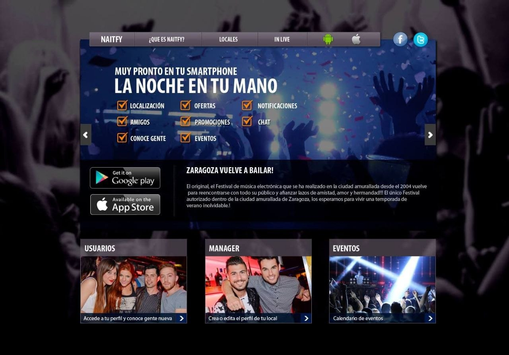
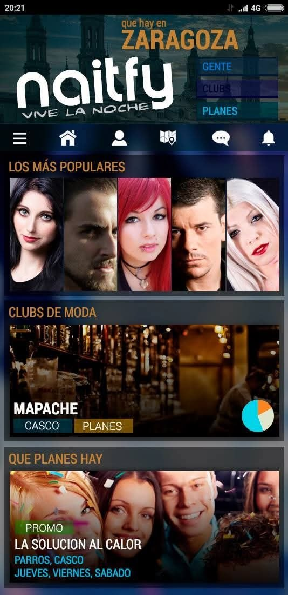
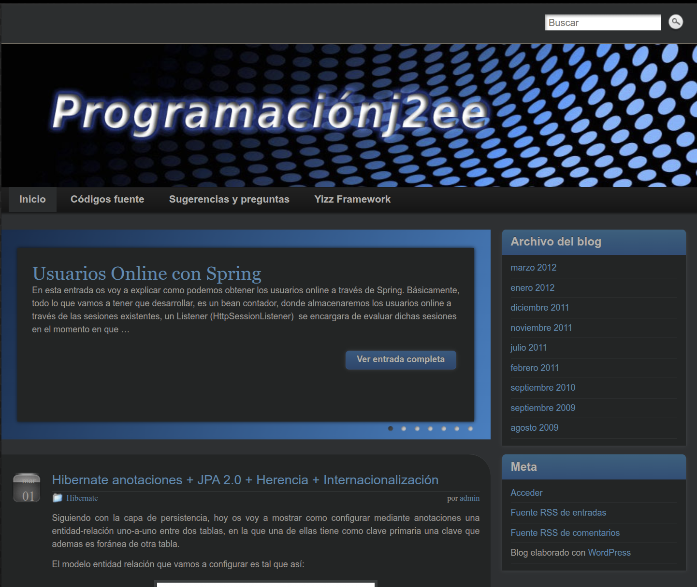
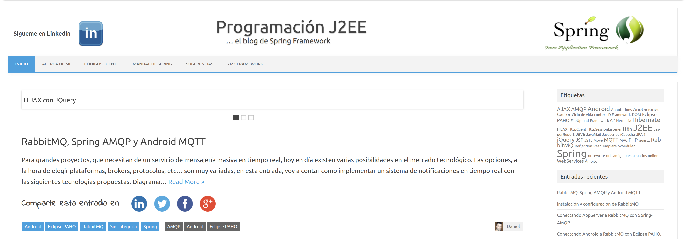

<!-- Header Banner -->
<div align="center">

# 👋 Hi, Daniel here!

### **Platform Engineer & DevEx Specialist**


**Specialized in Software Engineering at Enterprise Scale**


📍 Zaragoza, Spain &nbsp;|&nbsp; 🏢 IriusRisk • Adidas • New Relic &nbsp;|&nbsp;
📧 [LinkedIn](https://www.linkedin.com/in/danielpardoligorred/)

</div>

---

## About Me

As a kid, I loved building with Meccano. But the first time I saw a mouse pointer move across a screen, everything
changed. That simple magic hooked me on programming, and I haven't stopped building since.

I started writing code at twelve. By my early twenties, I turned that passion into a career, freelancing to build custom
e-commerce sites and digital tools for clients. Over two decades later, after working with international companies
like **IriusRisk**, **Adidas**, and **New Relic**, I've evolved from designing and writing distributed systems to
designing the platforms that power them.

Today I build ecosystems that reduce cognitive load and automate the boring
stuff, so engineering teams can focus on delivering value instead of fighting with technological friction.

If I had to choose one testimonial from the thousands of interactions throughout my career, I would highlight this one
by one of my line managers at Adidas.
> The one engineer to go for getting things done.
>
> -- [Jose Maria Puyal](https://www.linkedin.com/in/josepuyal/)
>
> Context: Creator's Club MVP delivery in the EEUU during the summer of 2018.

### What I Do in My Free Time

I pour my energy into three main passions.

- **[Financial Literacy](https://www.financialbreaker.com)** - understanding how the world works.
- **Software Engineering** - building things to solve complex problems.
- **[Electronic Music Production](https://open.spotify.com/artist/42xGjvlq05ZQ90f398AhGh?si=zeroAFZKST-uKi-R7PqMTQ)** -
  fueling my soul while sharing it with others.

These three areas are where I invest my energy and the topics I most enjoy exploring in conversation.

## The Mandalorian Creed: Learning by Doing was Always the Way

Despite the catchy section title, what follows isn't self-promotion, it's the genuine approach that defines my way of
being.

It has never been about writing code or studying theory, nor even finding a job, making profits in the market, or
understanding how the frequencies of sound shape an 808 distorted kick. It's always been about mastering the craft
through deep understanding of what once caught my attention.

Having a purpose that I believe in is the fuel to keep me going.

> I hear and I forget. I see and I remember. I do and I understand.
>
> — Confucius

## Current Focus

I remain deeply hands-on with technical implementation:

* **Personal Projects:** Designing and implementing automated retraining pipelines for internal Small Language Models (
  SLMs)
* **Corporate Work:** Identifying operational friction points and implementing standardization and best practices—with
  creativity and a results-oriented mindset

## Professional Journey

### IriusRisk | Staff Platform & Release Engineer (DevEx Lead)

| Key              | Value                                 |
|------------------|---------------------------------------|
| **Organization** | IriusRisk                             |
| **Role**         | Staff Platform & Release Engineer     |
| **Duration**     | December 2022 – Present               |
| **Location**     | Remote / Zaragoza, Spain              |
| **Status**       | ✅ Completed — Platform Transformation |
| **Relevance**    | ⭐⭐⭐⭐⭐                                 |


**The Context**

IriusRisk was experiencing a high growth rate, with a 200% YoY ARR increase. The company was expanding rapidly, but
DevEx, especially the release process, had become a critical bottleneck, causing delays, service quality issues, and
customer dissatisfaction.

The company reached out with a critical first mandate, fix the software delivery process as quickly as possible to serve
world-class customers by improving Deployment Frequency and Lead Time to Change, while elevating the DevEx of a software
engineering team that was starting from a greenfield state.

**The Challenge:**

When I arrived, releases were a **4-week ordeal** requiring a lot of manual actions: dozens of Git operations across
multiple repositories, complex Jira ticket management, and mandatory CAB meetings with wide attendance.

- Tech Leads spentdays on code freezes, manually propagating dependencies.
- The legacy GoCD instance had become a bottleneck.
- Development teams couldn't manage their own pipelines, creating critical DevOps dependency.

Operating as a **one-man army**, I executed a long-term strategic roadmap while maintaining release success rates during
the transformation.

**What I Built:**

**1. Release Automation — "Release Services"**

Developed a comprehensive tool automating the entire release orchestration:

* All Git actions (branching, tagging) across repositories
* Jira ticket creation and release note drafting
* Cross-repository dependency management

**Impact:** Release orchestration from **~4 hours to ~5 minutes**. Manual interactions from **hundreds of steps to <10
clicks**.

**2. Release Lifecycle Transformation**

Established the Release Squad from scratch, enforcing **Trunk-Based Development** and **Release Flow** strategies:

* Replaced complex legacy git branch strategies with simplified workflows
* Eliminated LTS friction—onboarding new LTS versions from **days to 1 minute**
* Streamlined Change Advisory Board (CAB)—transformed from bottleneck to high-certainty confirmation step

**Impact:** Full release lifecycle from **4 weeks to 1 day**. Hotfixes delivered in hours. Received **financial award**
for impact.

**3. CI/CD Modernization — GoCD to Bitbucket Pipelines**

Led migration from legacy GoCD to Bitbucket Pipelines:

* Executed POC, designed standardized pipelines across all repositories
* Collaborated with DevOps to implement self-hosted autoscaling solution (cost minimization)
* Decommissioned legacy GoCD environment

**Impact:** Development teams gained **full autonomy** over their CI/CD workflows. Eliminated DevOps dependency.
Increased DevOps capacity by removing legacy plugin maintenance.

**4. Docker Agents Architecture (V1 → V2)**

* **V1:** Encapsulated tooling for Java build/publish operations, ensuring consistent build environments
* **V2:** Strategic two-layer architecture—base layer (common tooling, business logic) + tech-specific layer (Java,
  Node, Python)

**Impact:** Standardized pipeline execution across the entire organization regardless of technology stack. Drastically
increased project bootstrapping speed. Single point of evolution for platform capabilities.

**5. Developer Experience Acceleration**

* Pipeline templates reducing project bootstrapping from **days to hours**
* Automated dependency propagation—Tech Leads no longer manually execute builds or library upgrades
* Self-service capabilities eliminating operational burden

**Impact:** Returned valuable capacity to Tech Leads. Reduced code propagation time from **days to minutes**.
Significantly decreased Time to Market (TTM).

**6. Observability & Governance**

* Designed foundational principles for engineering standards and observability (o11y) strategy
* Implemented DORA metrics dashboards for business visibility
* Streamlined CAB processes to facilitate faster decision-making

**The Future: DevEx for Humans and AI Agents**

**Ephemeral Sandboxes Environment (Q2 2026):**

Before the ThreatModeler acquisition, I led the vision for ephemeral sandboxes aligned with the coming multi-tenant
scenario. As platform complexity grows with more microservices, developers, and incipient **agentic coding systems**,
need isolated environments to check, test, and share progress with stakeholders.

This homemade vision has been a critical point shaping my mission: **creating the best DevEx for developers and AI
agentic coding systems**.

**What This Role Taught Me:**

Platform Engineering is not about tools, it's about **removing friction** so engineers can focus on delivering value.
Every abstraction, every automation, every standardized workflow serves one purpose, **accelerating business delivery
while reducing cognitive load**.

Working as a one-man army at the very beginning taught me to prioritize ruthlessly, execute strategically, and always
connect technical decisions to business outcomes.

The for never-coming ephemeral sandboxes initiative represented my belief that, aside for the developer and other
stakeholders experience, **DevEx must evolve beyond human developers**, preparing for the present, where AI agents are
becoming first-class citizens in the development workflow.

### New Relic, Inc. | Senior Software Engineer (Core Data Platform)

| Key              | Value                              |
|------------------|------------------------------------|
| **Organization** | New Relic, Inc.                    |
| **Role**         | Senior Software Engineer           |
| **Duration**     | July 2021 – December 2022          |
| **Location**     | Remote / Zaragoza, Spain           |
| **Status**       | ✅ Completed — Hyper-Scale Platform |
| **Relevance**    | ⭐⭐⭐⭐⭐                              |


**Why I Joined:**

Back in 2021, monitoring was rising as a critical discipline in software engineering. When New Relic knocked on my door,
I saw two potential benefits:

* **Level up my understanding** of the state of the art in **Observability** (not just monitoring)
* **Tackle ultra-high scalability challenges** at a scale I hadn't experienced before

**The Team:**

I had a really good experience working alongside an excellent technical team of anonymous but very talented colleagues,
with flash collaborations with **Java Champions** like **Jason Clark**, **Benjamin Evans**, and other Silicon Valley
gurus like **Ron Crocker**.

As an interesting coincidence, **Ron Crocker** built for New Relic a **Kafka Clients archetype**, exactly like I did at
Adidas, integrating the raw Kafka clients with the New Relic agent for observability. I spent hours diving into that
code, learning new ideas and seeing how he approached the same challenges I had faced.

**The Challenge: Entity Platform — Ingestion Gate Service**

My main responsibility was the evolution and maintainability of the **gate ingestion service** for the Entity Platform
team, the domain area responsible for **synthesizing entities from raw telemetry datapoints** and managing the
relationships among them.

This was the entry point for the entire platform, where hundreds of millions of Kafka events per second flowed through.
If there's one place where it's **mandatory to work alongside a Profiler** to measure time complexity after any code
change, it was this service. Having **restrictive and challenging SLAs with top-tier customers around the world** added
pressure to only do things well.

**What I Built:**

* **Hyper-Scale Engineering:** Engineered optimizations for the **"Synthesis Service"** (platform entry point) to handle
  **hundreds of millions of Kafka events per second**, ensuring strict SLA compliance for top-tier customers
* **Streaming Architecture:** Redesigned streaming pipeline components to process **complex entity relationships** with
  extreme time efficiency, every micro-optimization mattered at this scale
* **Schema Governance:** Managed the public repository
  [`newrelic/entity-definitions`](https://github.com/newrelic/entity-definitions) defining the synthesis shape of
  entities, serving as a critical integration point for the platform
* **Community Collaboration:** Created synthesis rules alongside the community—open governance for entity definitions
* **Profiler-Driven Development:** Every code change required profiling validation to ensure time complexity didn't
  regress—no deployment without measurable proof

**What This Role Taught Me:**

Working at New Relic during the observability boom gave me a premium seat to **hyper-scale engineering practices**.
The discipline of **profiler-driven development**, where every change must be validated with measurable performance
data, shaped how I approach optimization problems.

Collaborating with engineers who built observability tools used by thousands of companies worldwide expanded my
understanding of what **production-grade scalability** really means and how a well-defined Observability strategy
involving the full SDLC helps on this matter.

### Adidas | Tech Lead & Streaming Architect (Enterprise Architecture Transformation)

| Key              | Value                                        |
|------------------|----------------------------------------------|
| **Organization** | Adidas                                       |
| **Role**         | Tech Lead & Streaming Architect              |
| **Duration**     | October 2018 – June 2021                     |
| **Location**     | Zaragoza, Spain                              |
| **Status**       | ✅ Completed — Department-Wide Transformation |
| **Relevance**    | ⭐⭐⭐⭐⭐                                        |


**The Mission: Enterprise Architecture Transformation**

After the Creators Club MVP success in the US and 7+ additional markets, the Direction levels of the Consumer Engagement
department decided to extend the modern architectural concepts to all domains within the department.

The Architecture Directors board approved a wide proposal, and I moved to a **new team created from scratch** with the
mission of transforming how the Consumer Engagement department's domains communicated with each other.

**The Challenge:**

Multiple domains with vastly different stacks were communicating through legacy, highly inefficient approaches. The goal
was to:

* Identify all communication channels across domains
* Propose modern communication strategies
* Execute a progressive, well-paced transformation schedule

**Phase 1: Discovery & Strategy**

Working with every department domain, we created a comprehensive catalog of communication channels and procedures. The
Architecture Board defined two main communication strategies:

* **REST APIs (API Evangelist):** Each domain defined their own REST APIs for synchronous E2E communications — **led by
  the API Evangelist, not part of my responsibilities**
* **Consumer Event Hub (CEH):** A **single, unified Kafka topic catalog for the entire department** for high-scale async
  communications — **this was my responsibility**

**Phase 2: Implementation — What I Built**

**1. Consumer Event Hub (CEH) — Kafka-Driven Integration**

I established a well-paced calendar with a dedicated board, working closely with backend engineers from each domain to
onboard them into the CEH by publishing and consuming events.

* **Unified Kafka Topic Catalog:** Single source of truth for the entire Consumer Engagement department — replacing
  legacy point-to-point integrations
* **DDD Restructuring:** Spearheaded restructuring of SIX domains using Domain-Driven Design principles

**2. DevOps Excellence — Jenkins Pipeline Library**

Engineered a centralized Jenkins pipeline library to unify release processes across all teams:

* **Groovy DSL (Jenkinsfile):** Two approaches for TBD (Test-Driven Build) and GitHub release strategies
* **Template-Based Setup:** Place the Jenkinsfile template, modify a few DSL lines and parameters, and any repository
  was ready to publish and deploy
* **Impact:** Reduced new project setup time from **~2 weeks to ~30 minutes**

**3. Developer Experience — Java/Kafka Archetype**

Developed a custom Java/Kafka archetype to abstract boilerplate complexity and enforce observability standards:

* **Pre-configured Metrics:** Designed datapoints and dimensional metrics for both technical and business monitoring
* **Zero-Boilerplate Setup:** Developers didn't waste time on project bootstrapping
* **Impact:** Reduced service bootstrapping time from **~1 week to ~1 hour**

**4. Data Privacy Platform (DPP) — GDPR/CCPA Compliance**

*End-2019 Crisis Response:*

Just before Q4 2019, the company faced a critical situation, an external partner chosen to build the Data Privacy
Platform had failed. With only **3.5 months** to deliver, I had to:

* Build a team from scratch (engineers from Consumer Engagement transformation + 2 engineers from other projects
  temporarily)
* Design and build the platform from greenfield
* Deliver GDPR/CCPA compliance under extreme pressure

**What We Built:**

* **Kappa Streaming Architecture:** Aggregating distributed PII data across the organization
* **40+ Integrations:** Internal and external services connected via streaming architecture adapters
* **Cross-Functional Leadership:** Orchestrated a team of SEVEN engineers to deliver in under 4 months

**Impact:**

* ✅ **Delivered in 3.5 months** — platform went live on schedule
* 🏆 **Received Spot Bonus** for exceptional delivery under extreme pressure
* 📊 **40+ integrations** operational with internal and external services
* 🛡️ **GDPR/CCPA compliance** achieved across all consumer data domains

**Platform Specialist & Internal Consultant:**

Beyond the architectural transformation, I served as the **de facto platform specialist** for the entire Consumer
Engagement department:

* **Kubernetes Namespaces:** Configured and managed namespaces for all teams undergoing transformation—handling RBAC,
  resource quotas, network policies, service accounts, and ingress configurations
* **Kafka Topics:** Designed and provisioned topic structures across the Consumer Event Hub—partitioning strategies,
  retention policies, ACLs, and schema registry integration
* **Kafka Clients:** Supported teams integrating with the Kafka archetype—troubleshooting consumer groups, offset
  management, serialization, and error handling
* **CI/CD Pipelines:** Configured Jenkins pipelines for dozens of teams—customizing build steps, deployment strategies,
  environment promotions, and integration with Kubernetes clusters
* **Cross-Team Support:** Acted as internal consultant for teams lacking platform expertise—unblocking adoption, solving
  infrastructure challenges, and ensuring consistent patterns across domains

This hands-on platform work alongside architectural leadership gave me a **unique 360-degree view**, from high-level
enterprise strategy down to YAML configurations and pipeline DSL scripts.

**Leadership & Team Building:**

* **Hiring:** Managed onboarding and conducted technical interviews for Senior roles
* **Team Structure:** Played a key role in shaping the engineering team structure
* **Knowledge Transfer:** Worked closely with domain teams to onboard them into modern architectural patterns

**The Aftermath:**

For over a year after DPP delivery, I continued technically leading the stabilization of the Data Privacy Platform while
advancing the digital transformation work across the department.

This period defined my evolution from **project-focused architect** to **enterprise transformation leader**,
orchestrating change across multiple domains while delivering critical business initiatives under pressure.

### Adidas | Tech Lead & Streaming Architect (Creators Club)

| Key                    | Value                           |
|------------------------|---------------------------------|
| **Organization**       | Adidas                          |
| **Role**               | Tech Lead & Streaming Architect |
| **Duration**           | November 2017 – October 2018    |
| **Location**           | Zaragoza, Spain                 |
| **Project Status**     | Running in Production           |
| **Personal Relevance** | ⭐⭐⭐⭐⭐                           |


**Project: [Creators Club (Loyalty Program)](https://www.adidas.com/us/adiclub) — Worldwide Priority #1 (2018-2019)**

The Creators Club was Adidas's flagship loyalty program, ranked as the #1 strategic project worldwide for 2018-2019. The
original POC (called "Loyalty Program") launched in Russia by an external partner was a business success but a technical
disaster, riddled with race conditions, unable to scale for new "engagements" (loyalty point sources), and completely
unprepared for major market expansion.

**Why I Was Chosen:**

Adidas headhunted me during their late-2017 insourcing wave, bringing me in to lead a starting team with one mission,
make this project scale for the US market launch (Adidas + Reebok).

I inherited a codebase with an uncooperative external partner, having to reverse engineering the system from source code
as the only reliable source of truth.

**The Technical Debt:**

The original system consisted of two monolithic services, one using Spring Batch for reading external sources, another
API for processing and fetching data. The JPA repository layer didn't exist, SQL was hardcoded without design, not even
leveraging proper JOIN, GROUPING... strategies. It was a fundamentally broken foundation.

**What I Built:**

* **Kappa Streaming Architecture:** Extracted business logic from the monolith, redesigned the entire platform around
  Apache Kafka + Spring Boot microservices—each with a specific purpose, layered for scalability
* **Software Design & Architecture:** Architected a robust, scalable, and maintainable Hibernate JPA repository layer
  with transactionality managed at the service layer, following Spring Framework best practices and traditional
  microservices patterns.
* **Throughput Optimization:** Resolved critical race conditions and increased system throughput by **>300x** through
  proper architectural design
* **E2E Testing Framework for Streaming Systems:** As streaming architectures were emerging, the Platform QA team had no
  ready approach for end-to-end testing. I collaborated with them to create a custom framework combining:
    * **CDC Patterns** (Change Data Capture) for tracking state changes across the pipeline
    * **MQTT with Ephemeral Topics** for unit test isolation—each test spin-up created temporary topics, ensuring no
      cross-contamination
    * **Java DSL Structure** providing a fluent, readable API for test definitions
    * **Glue Code Integration** connecting the testing tool through Gherkin syntax with the streaming infrastructure
* **Automated QA Transformation:** Replaced manual QA processes (~10 working days per release) with automated E2E
  testing (~15 minutes), enabling true Test-Driven Development for streaming systems
* **Monolith Decomposition:** Broke the monolith while simultaneously introducing the new QA automation approach (
  parallel transformation)
* **Database Constraints:** Navigated significant database restrictions in early phases while designing the new
  architecture
* **AWS + Kubernetes from Scratch:** This project introduced me to cloud infrastructure and container orchestration at
  scale. I set up everything at the namespace and monitoring stack. First hands-on experience with modern cloud-native
  infrastructure that would define my career trajectory.
* **Rules Engine Migration (Cost Savings):** Re-architected the Rules Engine from JBOSS BRMS server to Drools library
  integrated directly into the streaming architecture. Eliminated expensive annual licensing costs while improving rule
  evaluation performance.

**Impact:**

* **US Market Launch:** Successfully delivered productive MVP in **under 6 months**—the US launch was a major success
* **Global Scale:** Architecture supported progressive rollouts across Central & South America, Europe, and APAC
  markets—handling heavy loads due to scalability-first design
* **Longevity:** The architecture proved so robust that **as of 2026, it remains the foundational architecture** of the
  Creators Club program
* **Recognition:** Received a **Spot Bonus** for exceptional delivery under extreme pressure
* **Mentorship:** Provided technical mentorship to trainees, facilitating their professional growth within the
  engineering team
* **QA Innovation:** The E2E testing framework became the reference implementation for streaming system testing across
  the organization

**What's Next:**

This success led to my transition into an expert team within the same department, tasked with driving a massive digital
transformation to enhance domain services communication across the organization.

### Digital Takers (Consultant for Adidas) | Big Data & Platform Engineering

| Key                    | Value                                  |
|------------------------|----------------------------------------|
| **Organization**       | Digital Takers (Consultant for Adidas) |
| **Role**               | Big Data & Platform Engineer           |
| **Duration**           | July 2016 – November 2017              |
| **Project Status**     | Running in Production                  |
| **Personal Relevance** | ⭐⭐⭐                                    |


**Project: BAM (Business Analytics Monitoring) Tool**

It is an internal platform engineering initiative to create a central metrics gathering and processing tool, enabling
VP-level strategic decision-making across the company, especially in logistic distribution.

**The Challenge:**

The local platform engineering team headhunted me for my experience designing streaming architectures. My work was
already known in the city after I presented the `Naitfy` project at local conferences. Those were the early days of
`Apache Kafka`. Even though my background was with other message brokers, I stood out as the only local candidate with
real, hands-on experience building Kappa streaming architectures.

My background with Elasticsearch and building microservices with Spring Framework sealed
the fit.

I was chosen by an ex-Spotify backend engineer with solid `Apache Kafka` experience who was leading the project in the
early stage.

**What I Built:**

* **Central Processing Topology:** Apache Storm topology processing hundreds of thousands of events from multiple
  internal sources, composing a unified "entity" view in Elasticsearch from heterogeneous event streams
* **First Central Kafka Cluster:** Deployed and managed the company's first central Apache Kafka cluster, evangelizing
  Event-Driven Architecture across the organization
* **First Central Elasticsearch Cluster:** Built the foundational Elasticsearch infrastructure that became the knowledge
  base for strategic analytics
* **Container Orchestration (Early Days):** Deployed on Docker Swarm during the Kubernetes vs Swarm wars, the old
  version
  where we had to manually deploy the ETCD cluster first, then attach every Docker Swarm node to it
* **Infrastructure as Code (Before IaC Was a Thing):** Managed the entire infrastructure with bash scripts
* **CI/CD Evolution:** Started with TeamCity, later migrated to Jenkins
* **Full Platform Ecosystem:**
    * UI application built with AngularJS
    * Backend REST services with Spring Framework
    * API Gateway (Spring + Apache Zuul) handling authentication, authorization, and Layer 7 load balancing
    * Spring Archiving service for time-based Elasticsearch index lifecycle management
    * Multiple integration services pushing events to other domain areas

**Impact:**

This POC extended the use of Elasticsearch and Apache Kafka to the entire organization. The decision shaped my incoming
years, first by insourcing me directly into Adidas, and secondly by establishing me as a **Streaming Architecture
Expert + Spring Tech Lead** for the following years to come.

### Hermes (E-commerce Platform)

| Key                    | Value                                          |
|------------------------|------------------------------------------------|
| **Organization**       | [Hiberus Tecnologia](https://www.hiberus.com/) |
| **Project Status**     | Completed — Enterprise migration               |
| **Personal Relevance** | ⭐⭐                                             |


The local company internalized me because of my work on ProgramacionJ2EE.com. They were seeking someone with experience
in Spring Framework to modernize their homemade e-commerce platform.

There, I contributed through different stages:

1. Rebuilt the application's core from Struts to Spring Framework 3
2. Migrated the ongoing customer base Hermes applications to Spring Framework
3. Maintained and supported the most relevant customer Hermes applications
4. Built a seminar to reskill other Java teams throughout the entire organization

### Naitfy (Social Network)

| Key                    | Value                               |
|------------------------|-------------------------------------|
| **Organization**       | Freelance                           |
| **Project Status**     | Completed — 3+ years of development |
| **Personal Relevance** | ⭐⭐⭐⭐⭐                               |


|                                           *Landing page*                                            |                                              *Android home*                                              |
|:---------------------------------------------------------------------------------------------------:|:--------------------------------------------------------------------------------------------------------:|
|  |  

**Vision: The Ultimate Nightlife Experience**

Naitfy was a social network designed to deliver the best nightlife experience, by connecting people with pubs, discos,
and
music shows happening around them. The platform offered a comprehensive catalog of events, venues, exclusive offers, and
an innovative way to meet other people sharing the same moment.

**The Challenge: Pre-Cloud Era Engineering**

This project was built during an era before modern cloud providers abstracted infrastructure complexity. There were no
managed services, no "click-to-deploy" solutions. Every decision required deep understanding, creativity, and hands-on
implementation. Knowledge was built by doing, not by clicking buttons on a UI. This is where bullet-proof engineers
are forged, from design to deployment, weaving together disparate technologies and facing with everything across the
entire SDLC.

**Architecture: N-Tier Layered Design**

Built with a classic Spring Framework N-Tier architecture:

* **Shared Core Artifacts:** Global entities and repositories shipped as dedicated artifacts (exactly like the service
  layer)
* **Microservice Pattern:** Each service imported shared dependencies but could extend with custom implementations as
  needed
* **Clean Separation:** Proper layering between data access, business logic, and presentation following SOLID principles

**Data Architecture: Dual-Database Strategy**

* **MariaDB:** Structured data storage, users, venues (locals), events, and core entities requiring ACID guarantees
* **Elasticsearch:** Specialized features like **user geohashing**, enabling location-based matching and discovery

**Geo-Location System: Geohashing at Scale**

Naitfy implemented a powerful geolocation system using **geohashing** to:

* Locate users at different venues in real-time
* Surface the best nightlife plans based on proximity
* Enable "Tinder-like" matching for people who liked each other **and** were sharing time at the same place
  simultaneously

**Real-Time Communication: Dual Broker Architecture**

The live chat system used a **custom protocol built on top of MQTT**, leveraging two message brokers for different
purposes:

* **RabbitMQ:** General messaging workloads (MQTT plugin was limited at the time)
* **EMQTT:** Dedicated MQTT broker for high-performance pub/sub messaging
* Each broker served specific use cases where they excelled

**Distributed Infrastructure: Scalable by Design**

* **Hazelcast:** Distributed in-memory datagrid for:
    * Distributed user sessions across all services
    * Global TTL'd (time-to-live) data caching
    * Cluster-wide state management
    * Broadcast event-driven microservices communication for node management (RabbitMQ and EMQTT to serve other
      concerns)
* **Netty:** High-performance async resource services
* **GlusterFS:** Distributed network filesystem under the hood, providing scalable storage across the resource server
  swarm

**API Gateway Layer: Dual Gateway Architecture**

* **Main API Gateway:** All domain services behind a front-facing gateway handling:
    * SSL/TLS handshake termination
    * User authentication & authorization
    * Layer 7 load balancing
    * Request routing & filtering
* **Resources API Gateway:** Separate gateway for resource servers:
    * Integrated with distributed Hazelcast user sessions
    * Handled authentication for static/media resources
    * Dedicated load balancing for high-bandwidth endpoints

**Why This Matters:**

Naitfy was my **real university**, more than three years of development dealing with technology from every friction
point:

* Full-stack development (Android + Web + Backend domain-driven microservices)
* Distributed systems design (datagrid, messaging, storage)
* Infrastructure provisioning (before cloud abstraction)
* CI/CD pipeline creation
* End-to-end SDLC ownership

The personal dedication Naitfy required was, indeed, the main reason for decommissioning `ProgramacionJ2EE.com`, a
trade-off I made to build something ambitious and technically challenging.

### Yizz Framework (OOP PHP Framework)

| Key                    | Value                                              |
|------------------------|----------------------------------------------------|
| **Source**             | [GitHub](https://github.com/danipl/Yizz-Framework) |
| **Organization**       | Freelance                                          |
| **Project Status**     | Archived — Learning project                        |
| **Personal Relevance** | ⭐⭐                                                 |


Inspired by finding some Spring Framework 2.5 workflow while developing with PHP, this was a custom object-oriented PHP
framework that I built from scratch to learn and experiment with OOP principles in PHP 5.

The framework proved valuable across several freelance projects throughout the mid-2010s. It powered multiple
public-facing websites and served as the foundation for an internal dental clinic management application that handled
day-to-day operations.

### ProgramacionJ2EE.com (Educational Platform)

| Key                    | Value                          |
|------------------------|--------------------------------|
| **Organization**       | Freelance                      |
| **Project Status**     | Completed — 7 years of service |
| **Personal Relevance** | ⭐⭐⭐⭐⭐                          |


The early 2000s were a transformative period for technology, marked by the rise of the internet and the shift from
traditional client-server architectures to web applications and modern development practices. In the Spanish-speaking
world, there were very few reference websites covering programming technologies, and none discussing the emerging Spring
Framework. `ProgramacionJ2EE.com` was a personal initiative to provide the Spanish-speaking community worldwide with a
meaningful and practical resource for learning these technologies without barriers.

|                                                    *Oldest version*                                                    |                                                    *Newest version*                                                    |
|:----------------------------------------------------------------------------------------------------------------------:|:----------------------------------------------------------------------------------------------------------------------:|
|  |  |

Personally, I consider the decommissioning of `ProgramacionJ2EE.com` my biggest mistake. It positioned itself
organically at Google Rank 1 for Spring Framework searches in Spanish.

The blogsite built a strong community. As it grew substantially, the moderation demands increased beyond what I could
sustain alone, and my personal interests evolved in different directions. I was younger and lacked the business vision
to recognize its value, so I made the decision to shut it down.

Beyond that, `ProgramacionJ2EE.com` was noticed by prominent colleagues in my local area, which led them to bring me on
board as part of their team, immersing me in the corporate world by the first time.

But well, let's Google Gemini explain what it was.

```markdown
> Ey Gemini!, what it was ProgramacionJ2EE.com?

ProgramacionJ2EE.com was a prominent Spanish-language educational portal dedicated to Java Enterprise Edition (J2EE)
development. During the mid-2000s and early 2010s, it served as a central hub for Hispanic developers to find structured
tutorials, forums, and technical articles.

The site was particularly well-known for its "Pildoras Java" (Java Pills) and comprehensive courses that covered the
core pillars of enterprise Java. It focused on teaching technologies that were standard at the time, such as:

- Servlets and JSPs: The foundation of Java web development.
- Enterprise JavaBeans (EJB): For server-side managed components.
- Spring and Hibernate: Popular frameworks for MVC architecture and database mapping.
- Application Servers: Tutorials in configuring environments like JBoss (now WildFly), GlassFish, or Tomcat.

In an era before Stack Overflow and GitHub dominated the landscape, this site provided a localized community where
developers could troubleshoot specific errors in Spanish. The site's manual-style content became less aligned
with modern DevOps and microservices trends. While the original domain is no longer the active powerhouse it once was,
it remains a nostalgic reference point for an entire generation of programmers who learned backend web development in
the early 2000s.
```

Nor ChatGPT.

```markdown
> Ey ChatGPT!, what it was ProgramacionJ2EE.com?

ProgramacionJ2EE.com was a Spanish-language website focused on teaching Java Enterprise Edition (J2EE / later Java EE,
now Jakarta EE) development.

**What it was about**

It served mainly as a learning portal for Java developers, especially Spanish speakers, covering topics like:

- Servlets and JSP
- JDBC (database access)
- EJB (Enterprise JavaBeans)
- Web services (SOAP/REST)
- Frameworks like Struts, Spring, Hibernate
- Application servers (Tomcat, JBoss, etc.)

**Why it was popular**

- It was very accessible for beginners
- Content was structured like tutorials and step-by-step guides
- It filled a gap when most Java EE documentation was in English

**What happened to it**

The site is no longer active (as far as public access goes). Like many early 2000s tutorial sites:

- It likely became outdated as Java EE evolved into Jakarta EE
- Modern resources (official docs, Stack Overflow, YouTube, etc.) replaced its role
- It may still exist in archived form (e.g., Wayback Machine)

**Its legacy**

For many Spanish-speaking developers, it was one of the first entry points into enterprise Java, similar to how
sites like those serve learners today:

- Baeldung
- Stack Overflow
```

### DestrozatuMente.com (Web Application Game)

| Key                    | Value                                       |
|------------------------|---------------------------------------------|
| **Organization**       | Freelance                                   |
| **Project Status**     | Completed — University Final Degree Project |
| **Personal Relevance** | ⭐⭐                                          |


An online chained guessing game. It was my first "business" attempt and, more importantly, my first Spring Framework
project.

This project was selected to be part of my Final Degree Project at the university, earning me significant recognition.
It introduced Spring Framework for the first time as part of some Final Degree Project at
the [University of Zaragoza](https://www.unizar.es/).

The project natively integrated [JForum 3](https://github.com/rafaelsteil/jforum3) by @rafaelsteil.

---

## 📬 Let's Connect

* **[LinkedIn](https://www.linkedin.com/in/danielpardoligorred/)** — Connect with me
* **[GitHub](https://github.com/danipl)** — More projects and code

---

*Last updated: 2026*
